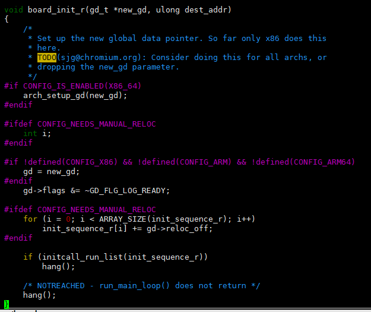
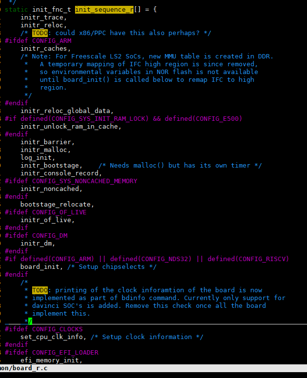

# A133的uboot的流程简单分析
由于客户产品需求，对于产品是否需要插电直接进入系统就需要做出修改，如下基于A133来简单看下流程。
1.u-boot-2018/common/board_r.c


board_init_r（）为入口，gd这个数据结构比较重要，后续会经常看到，在board_init_r（）中可以看出它会执行init_sequence_r中包含的一系列操作。下面是init_sequence_r的内容

以上截图是一部分，全部研究没那个精力，基本上就是启动流程了，我们可以关注其中的board_init(),board_late_init()

下面是board_init(),该函数定义在u-boot-2018/board/sunxi/board.c中

```
int board_init(void)
{
    __maybe_unused int id_pfr1, ret, satapwr_pin, macpwr_pin;


    gd->bd->bi_boot_params = (PHYS_SDRAM_0 + 0x100);


    sunxi_plat_init();


    int work_mode = get_boot_work_mode();


    ret = axp_gpio_init();
    if (ret)
        return ret;
#ifdef CONFIG_SUNXI_POWER
    if (!axp_probe()) {
        axp_set_dcdc_mode();
        axp_set_power_supply_output();
#if defined CONFIG_SUNXI_BMU && !defined CONFIG_AXP_LATE_INFO
        gd->pmu_saved_status = bmu_get_poweron_source();
        gd->pmu_runtime_chgcur = axp_get_battery_status();


        if (work_mode != WORK_MODE_BOOT) {
            ret = axp_reset_capacity();
            if (!ret) {
                pr_msg("axp reset capacity fail!\n");
            }   
        }   
#else
        gd->pmu_saved_status = -1;
#endif
    }   
#endif
    if ((work_mode == WORK_MODE_BOOT) ||
        (work_mode == WORK_MODE_CARD_PRODUCT) ||
        (work_mode == WORK_MODE_CARD_UPDATE))
        sunxi_set_sramc_mode();


    clock_set_corepll(uboot_spare_head.boot_data.run_clock);
    tick_printf("CPU=%d MHz,PLL6=%d Mhz,AHB=%d Mhz, APB1=%dMhz  MBus=%dMhz\n",
        clock_get_corepll(),
        clock_get_pll6(), clock_get_ahb(),                                                                                                                                                                                               
        clock_get_apb1(),clock_get_mbus());


    return 0;
}

```
下面截图是board_init(),该函数定义在u-boot-2018/board/sunxi/board_common.c中
```
int board_late_init(void)
{
    if (get_boot_work_mode() == WORK_MODE_BOOT) {
#ifdef CONFIG_SUNXI_SWITCH_SYSTEM
        sunxi_auto_switch_system();
#endif


#ifdef CONFIG_PMIC_TPS65185
        tps65185_modules_init();
#endif


#ifdef CONFIG_BOOT_GUI
        board_bootlogo_display();
#else
#ifdef CONFIG_SUNXI_SPINOR_JPEG
        int sunxi_jpeg_display(const char *filename);
        sunxi_jpeg_display("bootlogo");
#endif
#ifdef CONFIG_SUNXI_SPINOR_BMP
        read_bmp_to_kernel("bootlogo");
#endif
#endif


#ifdef CONFIG_EINK200_SUNXI
        sunxi_eink_fresh_image("bootlogo.bmp", 0x04);
        __udelay(3000);
#endif


#ifdef CONFIG_SUNXI_ANDROID_BOOT
        sunxi_fastboot_status_read();
#endif
#ifndef CONFIG_OF_SEPARATE
        sunxi_update_fdt_para_for_kernel();
#else
#ifdef CONFIG_SUNXI_REPLACE_FDT_FROM_PARTITION
        sunxi_replace_fdt();
        sunxi_update_fdt_para_for_kernel();
#endif
#endif
#ifdef CONFIG_SUNXI_USER_KEY
        /* update mac/wifi serial info in env */                                                                                                                                                                                         
        extern int update_user_data(void);
        update_user_data();
#endif
#ifdef CONFIG_SUNXI_MAC
        extern int update_sunxi_mac(void);
        update_sunxi_mac();
#endif
#ifdef CONFIG_SUNXI_CHECK_LIMIT_VERIFY
        int sunxi_check_cpu_gpu_verify(void);
        sunxi_check_cpu_gpu_verify();
#endif


#ifdef CONFIG_SUNXI_CHECK_CUSTOMER_RESERVED_ID
        int sunxi_check_customer_reserved_id(void);
        sunxi_check_customer_reserved_id();
#endif


#ifdef CONFIG_SUNXI_UBIFS
        if (nand_use_ubi())
            ubi_nand_update_ubi_env();
        else
#endif
        sunxi_update_partinfo();
        if (sunxi_update_rotpk_info()) {
            return -1;
        }
#ifdef CONFIG_SUNXI_POWER
        sunxi_update_axp_info();
#ifdef CONFIG_SUNXI_BMU
        axp_battery_status_handle();
#endif
#endif
        sunxi_respond_ir_key_action();
        sunxi_update_bootcmd();
#ifdef CONFIG_SUNXI_SERIAL
        sunxi_set_serial_num();
#endif
    }
    return 0;
}
```

基本上整uboot的流程顺着init_sequence_r都可以捋顺。

从uboot的串口打印信息可以看出axp_get_battery_status（）---->sunxi_update_axp_info()  ---->axp_battery_status_handle() 基本上是这个流程，也对应了上的流程。这三个函数定义在u-boot-2018/board/sunxi/power_manage.c中
```
int axp_get_battery_status(void)
{
    int dcin_exist, bat_vol;
    int ratio;
    int safe_vol = 0;
    dcin_exist   = bmu_get_axp_bus_exist();
    bat_vol      = bmu_get_battery_vol();
    script_parser_fetch(FDT_PATH_CHARGER0, "pmu_safe_vol", &safe_vol, -1);
    ratio = bmu_get_battery_capacity();
    /*ratio是电池电量百分比,当为-1时表示没有接电池*/
    /*bat_vol是电池电压*/
    /*safe_vol是dts中配置的charger0下的电池最低电压,目前该值为3500*/
    printf("-----niotong-----dcin_exist=%d, bat_vol=%d, ratio=%d, safe_vol=%d\n",dcin_exist, bat_vol, ratio,safe_vol);
    if (ratio < 1) {
        if (dcin_exist) {
            if (bat_vol < safe_vol) {
                return BATTERY_RATIO_TOO_LOW_WITH_DCIN_VOL_TOO_LOW;
            } else {
                return BATTERY_RATIO_TOO_LOW_WITH_DCIN;
            }
        } else {
            return BATTERY_RATIO_TOO_LOW_WITHOUT_DCIN;                                                                                                                                                                                   
        }
    } else {
        return BATTERY_RATIO_ENOUGH;
    }
}
```
主要关注返回值BATTERY_RATIO_TOO_LOW_WITH_DCIN_VOL_TOO_LOW，  BATTERY_RATIO_TOO_LOW_WITH_DCIN  ，BATTERY_RATIO_TOO_LOW_WITHOUT_DCIN，BATTERY_RATIO_ENOUGH这些

```
int sunxi_update_axp_info(void)
{
    int val = -1;
    char bootreason[16] = {0};                                                                                                                                                                                                                                                                                                                                                       
    int ret = 0, bat_exist = 0;
printf("-------niotong------sunxi_update_axp_info() in-----\n");
    ret = script_parser_fetch(FDT_PATH_POWER_SPLY, "battery_exist", &bat_exist, 1);
    if (ret < 0)
        bat_exist = 1;


printf("-------niotong------sunxi_update_axp_info() bat_exist=%d----\n",bat_exist);
#ifdef CONFIG_SUNXI_BMU
#ifdef CONFIG_AXP_LATE_INFO
    val = bmu_get_poweron_source();
#else
    val = gd->pmu_saved_status;
#endif
#endif
printf("----niotong------sunxi_update_axp_info() val=%d----\n",val);
printf("----niotong------sunxi_update_axp_info() pmu_get_sys_mode()=%d----\n",pmu_get_sys_mode());
    if ((val == -1) && (pmu_get_sys_mode() == SUNXI_CHARGING_FLAG)) {
        val = AXP_BOOT_SOURCE_CHARGER;
        pmu_set_sys_mode(0);
    }
    switch (val) {
    case AXP_BOOT_SOURCE_BUTTON:
        strncpy(bootreason, "button", sizeof("button"));
        break;
    case AXP_BOOT_SOURCE_IRQ_LOW:
        strncpy(bootreason, "irq", sizeof("irq"));
        break;
    case AXP_BOOT_SOURCE_VBUS_USB:
        strncpy(bootreason, "usb", sizeof("usb"));
        break;
    case AXP_BOOT_SOURCE_CHARGER:
        strncpy(bootreason, "charger", sizeof("charger"));
        if (bat_exist)
            gd->chargemode = 1;
        break;
    case AXP_BOOT_SOURCE_BATTERY:
        strncpy(bootreason, "battery", sizeof("battery"));
        break;
    default:
        strncpy(bootreason, "unknow", sizeof("unknow"));
        break;
    }
    env_set("bootreason", bootreason);
    return 0;
}

```
关注这个val也就是gd->pmu_saved_status,它表示设备启动的原因，gd->pmu_saved_status是在board_init()中获取的。

```
int axp_battery_status_handle(void)
{
    int battery_status;
    int ret = 0, bat_exist = 0;


printf("------niotong------axp_battery_status_handle() in-----\n");
    ret = script_parser_fetch(FDT_PATH_POWER_SPLY, "battery_exist", &bat_exist, 1);
    if (ret < 0)
        bat_exist = 1;


printf("------niotong------axp_battery_status_handle() bat_exist=%d----\n",bat_exist);
    if (!bat_exist)
        return 0;


#ifdef CONFIG_AXP_LATE_INFO
    battery_status = axp_get_battery_status();
#else
    battery_status = gd->pmu_runtime_chgcur;
#endif
    if (gd->chargemode == 1) {
        if ((battery_status == BATTERY_RATIO_TOO_LOW_WITH_DCIN_VOL_TOO_LOW)
            || (battery_status == BATTERY_RATIO_TOO_LOW_WITHOUT_DCIN)) {


#ifdef CONFIG_CMD_SUNXI_BMP
            sunxi_bmp_display("bat\\bat0.bmp");
#endif
#if 0
            tick_printf("battery ratio is low with dcin,to be shutdown\n");
            mdelay(3000);
            sunxi_board_shutdown();
#else
        sunxi_bat_low_vol_handle();
#endif
        } else {
#ifdef CONFIG_CMD_SUNXI_BMP
            sunxi_bmp_display("bat\\battery_charge.bmp");
#endif
        }
    } else if (battery_status == BATTERY_RATIO_TOO_LOW_WITHOUT_DCIN) {
#ifdef CONFIG_CMD_SUNXI_BMP
        sunxi_bmp_display("bat\\low_pwr.bmp");
#endif
        tick_printf("battery ratio is low without dcin,to be shutdown\n");                                                                                                                                                                                                
        mdelay(3000);
        sunxi_board_shutdown();
    }
    return 0;
}
```
关注bat_exist这个值，该值定义在sys_config.fex中如果为0表示电池不存在，为1表示电池存在。当该值为0的时候，相当于直接跳过函数中大部分的代码,设备直接启动进入系统，根本没有执行sunxi_bmp_display("xxxxxx"),在代码中搜索一下字段"sunxi_bmp_display",可以在u-boot-2018/board/sunxi/board_common.c文件中board_bootlogo_display（）中找到sunxi_bmp_display("bootlogo.bmp");