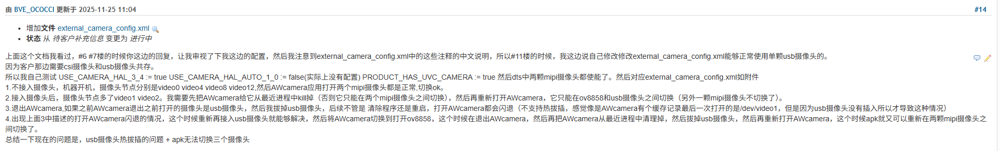

# A523 Android13 camera测试总结

我们原始的sdk以及开发板可以电量ov8858（sensor0 ）和ov5648(sensor1)两款摄像头，然后有客户想要用usb摄像头。

首先我们原始的sdk是：

> USE_CAMERA_HAL_3_4 := true
> USE_CAMERA_HAL_AUTO_1_0 := false(实际上没有配置)
> PRODUCT_HAS_UVC_CAMERA := true

dts中sensor0是okay  sensor1也是okay
camera.cfg中number_of_camera=2
rc文件insmod两个mipi摄像头驱动
然后external_camera_config.xml的内容如下

```
<ExternalCamera>
    <Provider>
   <!-- Internal video devices to be ignored by external camera HAL -->
   <CameraIdOffset>-2</CameraIdOffset>
        <ignore>
            <id>0</id>
            <id>4</id>
            <id>8</id>
            <id>12</id>
        </ignore>
   </Provider>
    <!-- Internal video devices to be ignored by external-only camera HAL -->
    <!-- See ExternalCameraUtils.cpp for default values of Device configurations below -->
    <Device>
        <!-- Max JPEG buffer size in bytes-->
        <MaxJpegBufferSize bytes="3145728"/> <!-- 3MB (~= 1080p YUV420) -->
        <!-- Size of v4l2 buffer queue when streaming >= 30fps -->
        <!-- Larger value: more request can be cached pipeline (less janky)  -->
        <!-- Smaller value: use less memory -->
        <NumVideoBuffers count="4"/>
        <!-- Size of v4l2 buffer queue when streaming < 30fps -->
        <NumStillBuffers count="2"/>
        <!-- List of maximum fps for various output sizes -->
        <!-- Any image size smaller than the size listed in Limit row will report
            fps (as minimum frame duration) up to the fpsBound value. -->
        <FpsList>
            <!-- width/height must be increasing, fpsBound must be decreasing-->
            <Limit width="640" height="480" fpsBound="30.0"/>
            <Limit width="1280" height="720" fpsBound="30.0"/>
            <Limit width="1920" height="1080" fpsBound="30.0"/>
            <!-- image size larger than the last entry will not be supported-->
        </FpsList>
        <CfgList>
            <CameraCfg cameraId="2" degree="90" facing="1" jpegOrientation="0"/>
            <CameraCfg cameraId="3" degree="90" facing="1" jpegOrientation="0"/>
        </CfgList>
    </Device>
</ExternalCamera>
```

经过测试摄像头打开两个摄像头正常，切换正常。但是插入usb摄像头AWcamera无法打开摄像头。

经过我多次的测试积累，总结如下
1.我发现不去insmod ov5648的驱动就可以让/dev/video8和/dev/video12节点消失（以前A133不是这样）
2.external_camera_config.xml中CameraIdOffset配置为-2，那么usb摄像头注册的时候cameraId就是2，cameraId是0和1就对应另外两个mipi摄像头。
如果只有一个mipi摄像头的话，那么这个CameraIdOffset需要配置为-1.
如果没有mipi摄像头的话，那么这个CameraIdOffset需要配置为0.
3.当usb摄像头注册的cameraId为2的时候，external_camera_config.xml中`<CameraCfg cameraId="2" degree="90" facing="1" jpegOrientation="0"/>`就生效了。
但是就是不能够配置有冲突，这个facing挺重要的，我们原始sdk无法打开usb摄像头原因就在这里，把这个facing配置成0就正常了，甚至你把这一行删掉都能够正常打开usb摄像头。
4.系统自带的AWcamera这个apk对于csi和usb摄像头同时存在，然后对于usb摄像头的热拔插不太友好，如下


