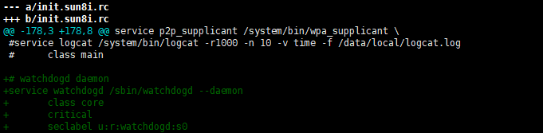

# A83T watchdog分析

因为客户机器存在运行时间长了，然后机器卡死的情况，所以客户想当机器卡死的时候，机器可以重启，所以需要使能看门狗。
因为A83T的sdk中已经有sunxi_wdt.c这个看门狗的驱动，所以先查看有没有编译这个驱动，如果驱动正常的话一般会有个/dev/watchdog的节点。
android这边android/system/core/init/watchdogd.c 就是编译生成/sbin/watchdogd的代码。再看下应该如何启动这个看门狗的守护进程。
所以在rc文件中加入了如下代码

看门狗原理是：init进程启动watchdogd进程，watchdogd负责隔断时间对看门狗进行喂狗操作（就是往/dev/watchdog中写入数据），一旦规定时间内没有喂狗操作的话，就会触发watchdog的重启系统的操作。所以当系统卡死的时候，一般watchdogd也会卡死，它也就不会去喂狗了，进而就能触发watchdog的重启了。

