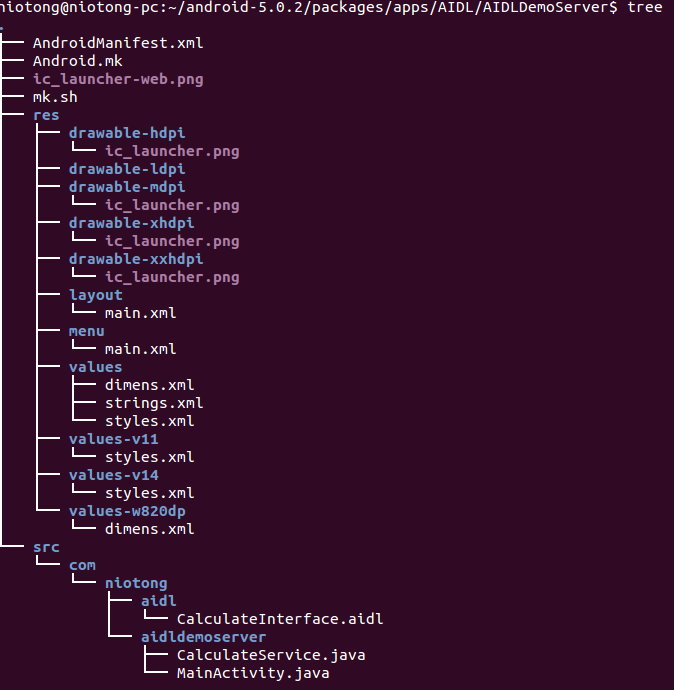
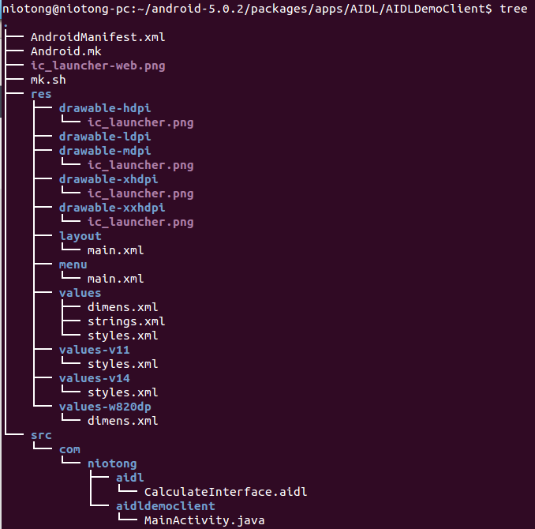

**服务端**


com.niotong.aidl.CalculateInterface.aidl代码如下

```
package com.niotong.aidl;

interface CalculateInterface{
    double doCalculate(double a,double c); 
}
```

com.niotong.aidldemoserver.CalculateService的代码如下,它提供来一个将两个数相加的服务

```
package com.niotong.aidldemoserver;

import com.niotong.aidl.CalculateInterface;
import android.app.Service;
import android.content.Intent;
import android.os.IBinder;
import android.os.RemoteException;
import android.util.Log;

public class CalculateService extends Service{

	private static final String TAG = "niotongyuan_CalculateService";
	private void LOG(String msg){
		Log.d(TAG,msg);
	}

	public void onCreate(){
		LOG("Service onCreate");
	}

	@Override
	public IBinder onBind(Intent arg0) {
		// TODO Auto-generated method stub
	//将stub返回给客户端
		LOG("Service onBind");
		return mBinder;
	}
	public void onStart(Intent intent,int startID){
		LOG("Service onStart" + startID);
	}

	public void onDestroy(){
		LOG("Service onDestroy");
		super.onDestroy();
	}

	public boolean onUnbind (Intent intent){
		LOG("Service onUnbind");
		return super.onUnbind(intent);
	}

	public void onRebind(Intent intent){
		LOG("Service onRebind");
		super.onRebind(intent);
	}

	private final CalculateInterface.Stub mBinder = new CalculateInterface.Stub() {
		//实现接口函数
		@Override
		public double doCalculate(double a, double b) throws RemoteException {
			// TODO Auto-generated method stub
			LOG("remote call from client! current thread id =  "+ Thread.currentThread());
			return a+b;
		}
	};


}
```

以下是AndroidManifest.xml中的内容

```
<?xml version="1.0" encoding="utf-8"?>
<manifest xmlns:android="http://schemas.android.com/apk/res/android"
    package="com.niotong.aidldemoserver"
    android:versionCode="1"
    android:versionName="1.0" >

    <uses-sdk
        android:minSdkVersion="19"
        android:targetSdkVersion="19" />

    <application
        android:allowBackup="true"
        android:icon="@drawable/ic_launcher"
        android:label="@string/app_name"
        android:theme="@style/AppTheme" >
		<service android:name="com.niotong.aidldemoserver.CalculateService">
		    <intent-filter >
		        <action android:name= "com.niotong.aidldemoserver.CalculateService"/>
		        <category android:name="android.intent.category.DEFAULT" />
		    </intent-filter>
		</service>
    </application>

</manifest>
```

由于这是个服务端，所以没有界面，结构中的MainActivity.java和对应的xml等没什么用。至此服务端就完成来。
这个<inter-filter>里的 <action android:name="com.niotong.aidldemoserver.CalculateService"/>很重要，客户端应该根据这个来找到对应的service的

**客户端**

文件结构服务端和客户端基本一样，因为服务端的代码就是从客户端复制过来的

com.niotong.aidl.CalculateInterface.aidl代码如下

```
package com.niotong.aidl;

interface CalculateInterface{
    double doCalculate(double a,double c); 
}
```

com.niotong.aidldemoclient.MainActivity.java代码如下

```
package com.niotong.aidldemoclient;

import com.niotong.aidl.CalculateInterface;
import com.niotong.aidldemoclient.R;

import android.app.Activity;
import android.content.ComponentName;
import android.content.Context;
import android.content.Intent;
import android.content.ServiceConnection;
import android.os.Bundle;
import android.os.IBinder;
import android.os.RemoteException;
import android.util.Log;
import android.view.View;
import android.widget.Button;
import android.widget.EditText;
import android.widget.TextView;

public class MainActivity extends Activity implements android.view.View.OnClickListener{

	Button bindBt;
	Button unbindBt;
	Button calBt;
	EditText numEt1;
	EditText numEt2;
	TextView resultTv;
	CalculateInterface mService;

	private static final String TAG = "niotongyuan_CalculateClient";
	private void LOG(String msg){
		Log.d(TAG,msg);
	}

    @Override
    protected void onCreate(Bundle savedInstanceState) {
        super.onCreate(savedInstanceState);
        setContentView(R.layout.main);
        bindBt = (Button) findViewById(R.id.bindBt);
        unbindBt = (Button) findViewById(R.id.unbindBt);
        calBt = (Button) findViewById(R.id.calculateBt);
        numEt1 = (EditText) findViewById(R.id.editText1);
        numEt2 = (EditText)  findViewById(R.id.editText2);
        resultTv = (TextView) findViewById(R.id.result);
        bindBt.setOnClickListener(this);
        unbindBt.setOnClickListener(this);
        calBt.setOnClickListener(this);

    }
	@Override
	public void onClick(View arg0) {
		// TODO Auto-generated method stub
		switch (arg0.getId()) {
		case R.id.bindBt:
			Bundle args = new Bundle();
			Intent intent = new Intent("com.niotong.aidldemoserver.CalculateService");
			intent.putExtras(args);
			bindService(intent, mConnection, Context.BIND_AUTO_CREATE);
			LOG("click bindBt");
			break;
		case R.id.unbindBt:
			LOG("click unbindBt");
			unbindService(mConnection);
			break;
		case R.id.calculateBt:
			LOG("click calculateBt");
			double a = Double.valueOf( numEt1.getText().toString());
			double b = Double.valueOf( numEt2.getText().toString());
			resultTv.setText("结果："+getResult(a,b));
			break;

		default:
			break;
		}
	}
	private double getResult(double a, double b) {
		// TODO Auto-generated method stub
	
		double result = 0;
		try {
			result = mService.doCalculate(a, b);
		} catch (RemoteException e) {
			// TODO Auto-generated catch block
			e.printStackTrace();
		}
		return result;
	}
	private ServiceConnection mConnection = new ServiceConnection() {
	
		@Override
		public void onServiceDisconnected(ComponentName arg0) {
			// TODO Auto-generated method stub
			LOG("onServiceDisconnected");
			mService = null;
		}
	
		@Override
		public void onServiceConnected(ComponentName arg0, IBinder arg1) {
			// TODO Auto-generated method stub
			LOG("onServiceConnected");
			mService = CalculateInterface.Stub.asInterface(arg1);
		}
	};
}
```

对应的界面布局文件main.xml如下

```
<LinearLayout xmlns:android="http://schemas.android.com/apk/res/android"
    android:layout_width="fill_parent"
    android:layout_height="fill_parent"
    android:orientation="vertical" >

    <TextView
        android:id="@+id/txNumber1"
        android:layout_width="wrap_content"
        android:layout_height="wrap_content"
        android:text="@string/num_1" />

    <EditText
        android:id="@+id/editText1"
        android:layout_width="match_parent"
        android:layout_height="wrap_content"
        android:text="@string/defvalue"
        android:ems="10"
        android:inputType="number" >

        <requestFocus />
    </EditText>

    <TextView
        android:id="@+id/txNumber2"
        android:layout_width="wrap_content"
        android:layout_height="wrap_content"
        android:text="@string/num_2" />

    <EditText
        android:id="@+id/editText2"
        android:layout_width="match_parent"
        android:layout_height="wrap_content"
        android:text="@string/defvalue"
        android:ems="10"
        android:inputType="number" />

    <Button
        android:id="@+id/bindBt"
        android:layout_width="wrap_content"
        android:layout_height="wrap_content"
        android:text="@string/bindStr" />

    <Button
        android:id="@+id/unbindBt"
        android:layout_width="wrap_content"
        android:layout_height="wrap_content"
        android:text="@string/unbindStr" />

    <Button
        android:id="@+id/calculateBt"
        android:layout_width="wrap_content"
        android:layout_height="wrap_content"
        android:text="@string/calbtStr" />

    <TextView
        android:id="@+id/result"
        android:layout_width="wrap_content"
        android:layout_height="wrap_content"
        android:text="@string/resultStr" />

</LinearLayout>
```

客户端的AndroidManifest.xml代码如下:

```
<?xml version="1.0" encoding="utf-8"?>
<manifest xmlns:android="http://schemas.android.com/apk/res/android"
    package="com.niotong.aidldemoclient"
    android:versionCode="1"
    android:versionName="1.0" >

    <uses-sdk
        android:minSdkVersion="19"
        android:targetSdkVersion="19" />

    <application
        android:allowBackup="true"
        android:icon="@drawable/ic_launcher"
        android:label="@string/app_name"
        android:theme="@style/AppTheme" >
        <activity
            android:name="com.niotong.aidldemoclient.MainActivity"
            android:label="@string/app_name" >
            <intent-filter>
                <action android:name="android.intent.action.MAIN" />

                <category android:name="android.intent.category.LAUNCHER" />
            </intent-filter>
        </activity>
    </application>

</manifest>
```

至此客户端基本也完成了。当然代码也有些不完善:
1.EditText只能输入整数，同时其他一些异常情况没有去考虑
2.Service端没有界面，其实可以弄个界面出来，来控制服务是否开启
3.服务端的生命周期我自己还有些没有整明白

