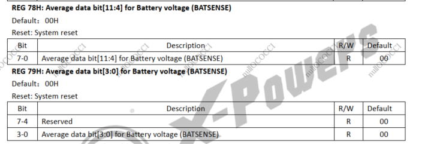
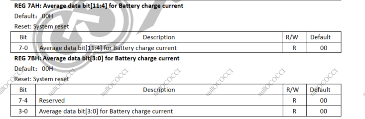
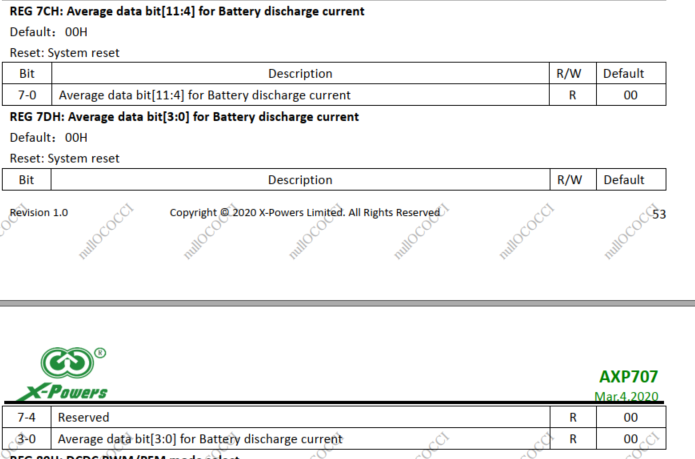
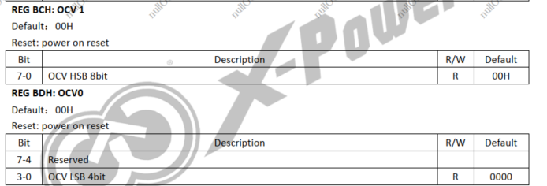
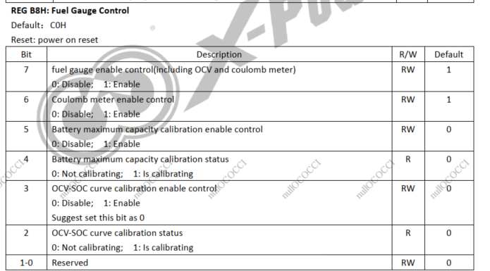
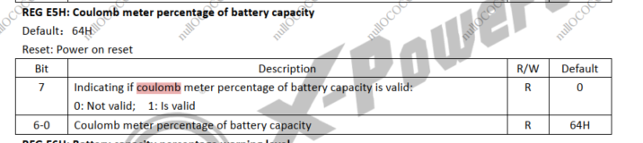

# AXP707充电相关的理解

最近客户再次反馈A133+AXP707机器充电，当电池的电量达到95%之后，会在95%停留很长时间（30多分钟,或者更长)，且这个问题并不是第一次反馈之前在A63+AXP803的机器上同样反馈过这样的问题。当时A63机器解决这个问题的方法是“ B8寄存器的bit6设置为0”。经过查看AXP707和AXP803的寄存器描述发现他们都一样，我猜测这两个PMIC大概率是同一个型号。

然后我自己也测试了确实存在这样的情况，电池的曲线参数是我用机器测试出来的，然后将参数更新到board.dts中，然后将机器从低电量开始接AC给机器充电，调试串口执行 echo 0xf > /sys/class/axp/debug_mask ，这样就可以一直打印axp的调试信息。

系统会持续打印：

> [20531.897158] healthd: battery l=97 v=4228 t=30.0 h=2 st=2 c=693 fc=7051408 chg=a

开启AXP的打印信息之后会打印：

> [20542.109549] ic_temp = 50
> [20542.112531] vbat = 4228
> [20542.115357] ibat = 693
> [20542.118035] charge_ibat = 693
> [20542.121413] dis_ibat = 0
> [20542.124296] ocv = 4171
> [20542.126990] rest_vol = 97
> [20542.130011] rdc = 82
> [20542.132530] batt_max_cap = 7051
> [20542.136099] coulumb_counter = 7051
> [20542.139976] AXP803_COULOMB_CTL = 0xe2
> [20542.144134] ocv_percentage = 97
> [20542.147749] col_percentage = 97
> [20542.151370] bat_current_direction = 1
> [20542.155512] ext_valid = 1

healthd中打印的l = 97 这个值应该是来源 rest_vol=97,然后对应这个有些复杂，大部分时候来源于AXP803_CAP（0xB9寄存器），我个人理解是该寄存器优先采用库仑计测量到的电量，然后再采用电压计测量到的电量。

healthd中打印的v=4228 这个值应该是来源 vbat= 4228 ,然后对应来源于AXP803_VBATH_RES（0x78寄存器）

healthd中打印的c=693 这个值应该是来源 charge_ibat - dis_ibat = 97 ,
然后charge_ibat 对应来源于AXP803_IBATH_REG（0x7A寄存器）

然后dis_ibat 对应来源于AXP803_DISIBATH_REG（0x7C寄存器）

然后再说说AXP调试信息中其他值的来源吧
ocv=4171 ,然后对应来源于AXP803_OCVBATH_RES（0xBC寄存器）

AXP803_COULOMB_CTL = 0xe2，这个值来源于AXP803_COULOMB_CTL（0xB8寄存器）

ocv_percentage=97，这个值来源于AXP803_OCV_PERCENT（0xE4寄存器）

col_percentage = 97 ,然后对应来源于AXP803_COU_PERCENT（0xE5寄存器）

其他的值自行看代码和芯片规格书。

然后我抓取充电阶段的调试串口信息如附件,对应board.dts的配置也如附件

总结一下，有以下规律：
1.board.dts中配置了pmu_battery_rdc= <54>;  pmu会自己计算出rdc
2.board.dts中配置了pmu_runtime_chgcur = <1800>; pmu充电的时候差不多会按照这个充电电流给电池充电，看调试串口信息最高峰充电电流可以达到1902mA,
大部分时候这个充电电流都是1800mA 。
3.客户发现pmu维持95%电量很长时间的原因是。库仑计测量到的col_percentage已经到达95% ,但它要等待电压计测量到的ocv_percentage也达到95%的电量，之后库仑计和电压计的电量才会同步携手升高到100%。
4.当col_percentage维持了很久的95%，然后ocv_percentage达到80%左右的时候，感觉充电电流开始慢慢降低。（充电电流的下降的条件不太确定）
5.board.dts中配置了pmu_init_chgvol= <4200>;  我认为这个应该就是配置的满电电压，然后vbat你可以理解为充电电压，它最高能够达到4246mV。所以建议pmu_init_chgvol值的配置最好是比电池的最高电压要低50mV.
6.当col_percentage维持了很久的95%，然后ocv_percentage达到95%左右的时候，vbat（可以理解为充电电压）这个时候它会下降一点，直到col_percentage和ocv_percentage同时到达100%的时候，vbat的值会和ocv一致。

