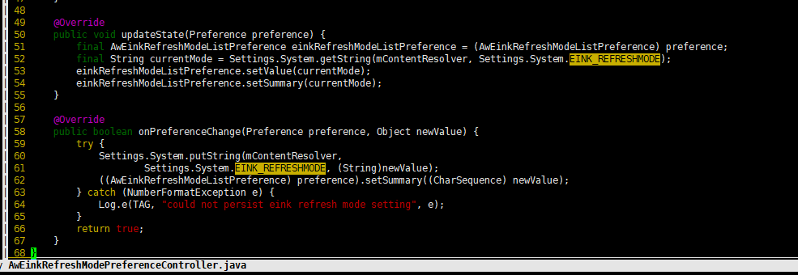
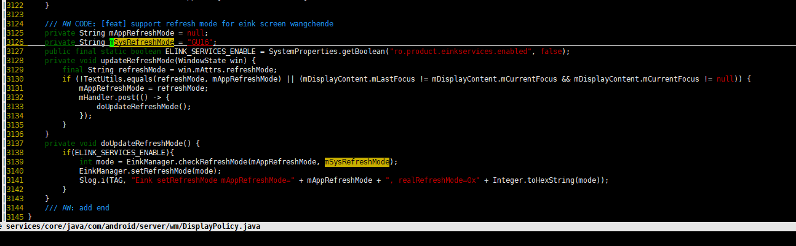
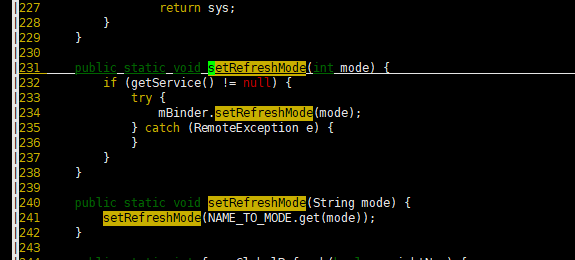
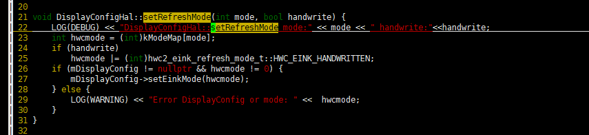

# B810的EINK屏的刷新模式

1.首先android/device/softwinner/epic/common/overlay/overlay/vendor/aw/public/package/apk/SettingsSetup/res/values/configs.xml

2.跟踪eink_refreshmode在android/frameworks/base/core/java/android/provider/Settings.java 5186行找到

3.再搜索EINK_REFRESHMODE，在android/packages/apps/Settings/src/com/android/settings/display/awdisplay/AwEinkRefreshModePreferenceController.java 找到

然后分析一下Settings下的代码结合android/packages/apps/Settings/src/com/android/settings/display/awdisplay/AwEinkRefreshModeListPreference.java以及
android/packages/apps/Settings/src/com/android/settings/res/values/aw_strings.xml
我的理解是SettingsSetup中的config.xml配置默认的eink刷新模式，然后这个值保存在provider中Settings.System.EINK_REFRESHMODE中，并且通过Settings应用配置的刷新模式，后续也会作为这个系统设置配置保存下来。
然后系统运行的时候android/frameworks/baseservices/core/java/com/android/server/wm/DisplayPolicy.java

然后重点关注EinkManager.setRefreshMode(mode);可以跟踪到android/vendor/aw/public/eink/services/java/com/softwinner/EinkManager.java

最终可以跟踪到android/vendor/aw/public/eink/services/DisplayConfigHal.cpp

进一步搜索setEinkMode，其实现方式在android/hardware/aw/display/目录下，大概率是eink-hal/disp2/Compositor.cpp

一般来讲不同的apk应该根据不同的场景切换不同的刷新模式，apk如何去设置刷新模式可以参考android/vendor/aw/public/eink/ReaderDemo下的代码。

