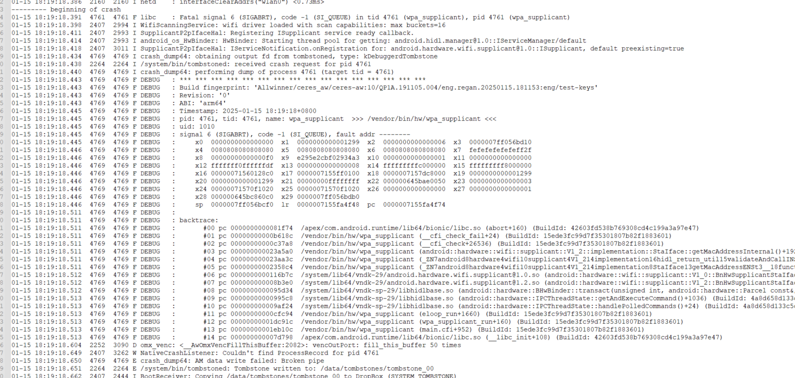

# CFI导致的libc的问题，进而导致AIC8800D40无法打开wifi

客户反馈A133 android10 plusv1.1的sdk，android系统原本编译的是32bit的系统，但是客户有需求将系统编译出64bit的。但是客户发现原本在32位系统上能正常使用的aic8800d40,编译出64位之后，wifi就不能正常打开了，但是蓝牙的使用没有问题
奇怪的是XR829在32位和64位系统下都是正常使用的。

最后经过AIC那边技术人员指导，是因为CFI导致的这种情况，所以做如下修改可以解决问题。

