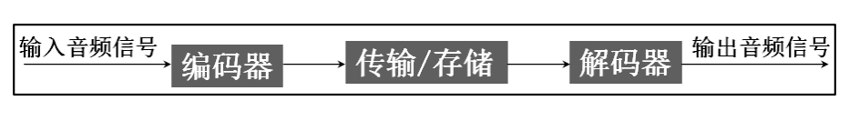
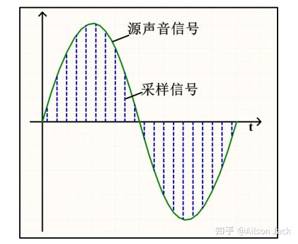
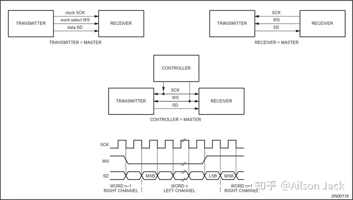
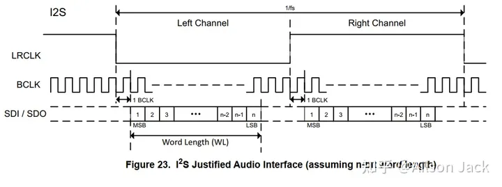
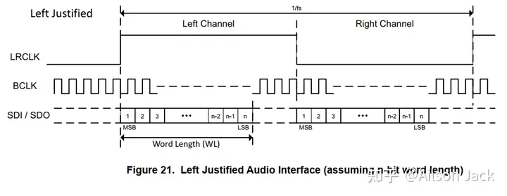
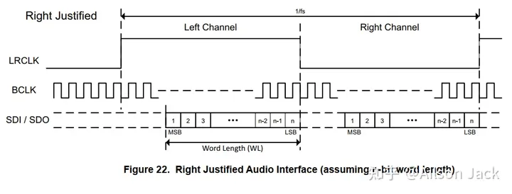

# I2S协议

## 一、数字音频技术

### 1.声音数字化概念及过程

现实生活中的声音是通过一定介质传播的连续的波，它可以由周期和振幅两个重要指标描述。正常人可以听到的声音频率范围为 20Hz\~20KHz。现实存在的声音是模拟量，这对声音保存和长距离传输造成很大的困难，一般的做法是把模拟量转成对应的数字量保存，在需要还原声音的地方再把数字量的转成模拟量输出如下图所示：

模拟量转成数字量一般可以分为三个过程，分别为采样、量化、编码，如下图所示。用一个比源声音频率高的采样信号去量化源声音，记录每个采样点的值，最后如果把所有采样点数值连接起来与源声音曲线是互相吻合的，只是它不是连续的。在图中，两条蓝色虚线距离就是采样信号的周期，即对应一个采样频率(FS)，可以想象得到采样频率越高最后得到的结果就与源声音越吻合，但此时采样数据量越越大，一般使用 44.1KHz 采样频率即可得到高保真的声音。每条蓝色虚线长度决定着该时刻源声音的量化值，该量化值有另外一个概念与之挂钩，就是量化位数。量化位数表示每个采样点用多少位表示数据范围，常用有 16bit、 24bit 或 32bit，位数越高最后还原得到的音质越好，数据量也会越大。

### 2.声音数字化三要素

采样频率：每秒钟抽取声波幅度样本的次数。采样频率越高，声音质量越好，数据量也越大。常用的采样频率有11.025KHz，22.05KHz，44.1KHz，48KHz，96KHz等。

量化位数：每个采样点用多少二进制位表示数据范围。量化位数也叫采样位数。量化位数越多，音质越好，数据量也越大。常用的采样位数有8位，16位，24位，32位等。

声道数：使用声道的个数。立体声比单声道的表现力丰富，但是数据量翻倍。常用的声道数有单声道，立体声（左声道和右声道）。

### 3.声音数字化的数据量

声音数字化后的数据量计算公式为：

> 音频数据量 = 采样频率(Hz) \* 量化位数 \* 声道数 / 8，单位：字节/秒。

这里举个例子：对一个声音信号进行数字化处理，采样频率为44.1KHz，量化位数为16位，那么：

单声道的音频数据量为：44100 \* 16 \* 1 / 8 = 88200 字节/秒；

立体声的音频数据量为：44100 \* 16 \* 2 / 8 = 176400 字节/秒。

### 4.声卡

声卡是负责录音、播音和声音合成的一种多媒体板卡。其功能包括：

(1).录制、编辑和回放数字音频文件；

(2).控制和混合各声源的音量；

(3).记录和回放时进行压缩和解压缩；

(4).语音合成技术(朗读文本)；

(5).具有MIDI接口(乐器数字接口)。

声卡的芯片类型：

(1).CODEC芯片(依赖CPU，价格便宜)；

(2).数字信号处理器DSP(不依赖CPU)。

## 二、I2S总线协议

### 1.I2S总线概述

音响数据的采集、处理和传输是多媒体技术的重要组成部分。众多的数字音频系统已经进入消费市场，例如数字音频录音带、数字声音处理器。对于设备和生产厂家来说，标准化的信息传输结构可以提高系统的适应性。

I2S(Inter-IC Sound)总线, 又称集成电路内置音频总线，是飞利浦半导体公司(现为恩智浦半导体公司)针对数字音频设备之间的音频数据传输而制定的一种总线标准。该总线专门用于音频设备之间的数据传输，广泛应用于各种多媒体系统。它采用了沿独立的导线传输时钟与数据信号的设计，通过将数据和时钟信号分离，避免了因时差诱发的失真，为用户节省了购买抵抗音频抖动的专业设备的费用。

### 2.I2S信号线

I2S总线主要有3个信号线：

(1).串行时钟SCK

串行时钟SCK，也叫位时钟BCLK，对应数字音频的每一位数据，SCK都有1个脉冲。SCK的频率 = 声道数 \* 采样频率 \* 采样位数。

(2).字段选择信号WS

字段选择信号WS，也叫LRCLK，用于切换左右声道的数据。WS的频率 = 采样频率。

字段选择信号WS表明了正在被传输的声道。I2S Philips标准WS信号的电平含义如下：

> WS为0，表示正在传输的是左声道的数据；
> 
> WS为1，表示正在传输的是右声道的数据。

(3).串行数据SD

串行数据SD，就是用二进制补码表示的音频数据。I2S串行数据在传输的时候，由高位(MSB)到低位(LSB)依次进行传输。

(4).主时钟MCLK

一般还有MCLK，主时钟。MCLK的频率 = 128或者256或者512 \* 采样频率。

对于系统而言，能够产生SCK和WS的信号端就是主设备，用MASTER表示，简单系统示意图如下：

### 3.几种常见的I2S数据格式

随着技术的发展，在统一的I2S硬件接口下，出现了多种不同的I2S数据格式，可分为左对齐(MSB)标准、右对齐(LSB)标准、I2S Philips 标准。

对于所有数据格式和通信标准而言，始终会先发送最高有效位(MSB 优先)。

发送端和接收端必须使用相同的数据格式，确保发送和接收的数据一致。

#### (1).I2S Philips 标准

使用LRCLK信号来指示当前正在发送的数据所属的声道，为0时表示左声道数据。LRCLK信号从当前声道数据的第一个位(MSB)之前的一个时钟开始有效。LRCLK信号在BCLK的下降沿变化。发送方在时钟信号BCLK的下降沿改变数据，接收方在时钟信号BCLK的上升沿读取数据。正如上文所说，LRCLK频率等于采样频率Fs，一个LRCLK周期(1/Fs)包括发送左声道和右声道数据。

对于这种标准I2S格式的信号，无论有多少位有效数据，数据的最高位总是出现在LRCLK变化（也就是一帧开始）后的第2个BCLK脉冲处。这就使得接收端与发送端的有效位数可以不同。如果接收端能处理的有效位数少于发送端，可以放弃数据帧中多余的低位数据；如果接收端能处理的有效位数多于发送端，可以自行补足剩余的位。这种同步机制使得数字音频设备的互连更加方便，而且不会造成数据错位。

I2S Philips 标准时序图如下所示：

#### (2).左对齐(MSB)标准

在LRCLK发生翻转的同时开始传输数据。该标准较少使用。注意此时LRCLK为1时，传输的是左声道数据，这刚好与I2S Philips标准相反。左对齐(MSB)标准时序图如下所示：

#### (3).右对齐(LSB)标准

声音数据LSB传输完成的同时，LRCLK完成第二次翻转（刚好是LSB和LRCLK是右对齐的，所以称为右对齐标准）。注意此时LRCLK为1时，传输的是左声道数据，这刚好与I2S Philips标准相反。右对齐(LSB)标准时序图如下所示：

