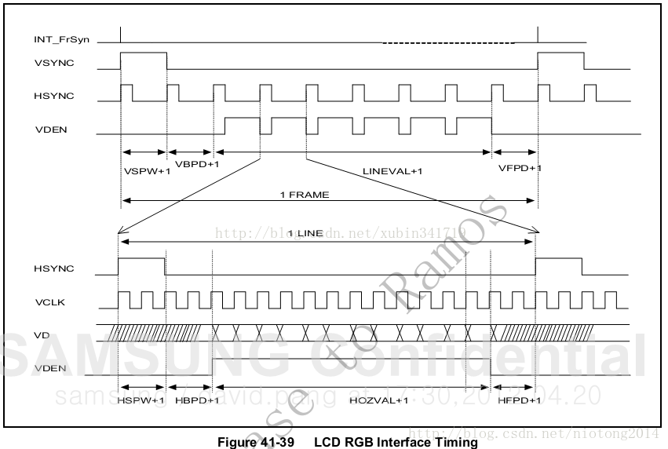
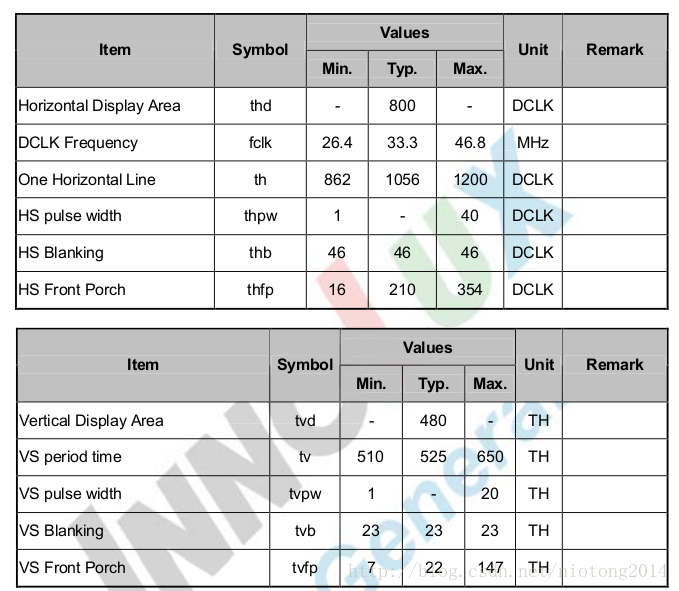
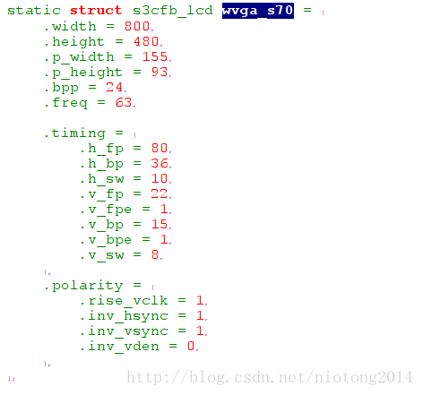
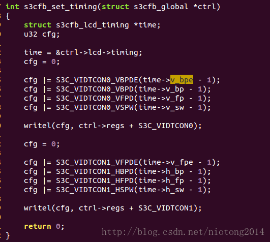
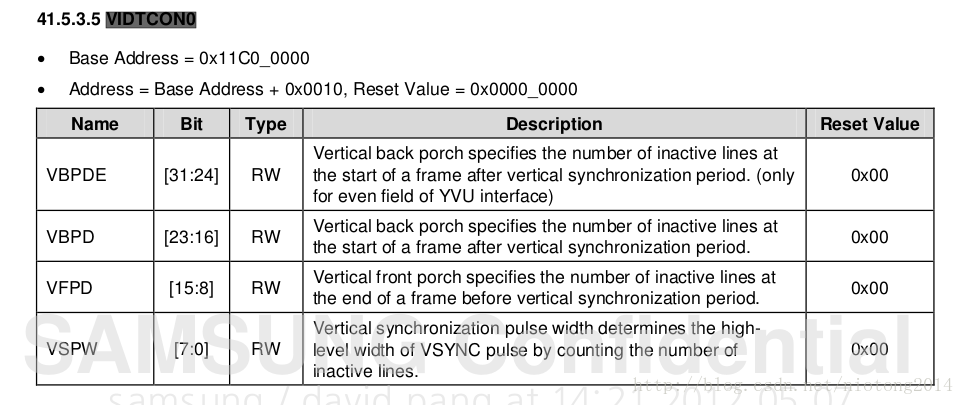
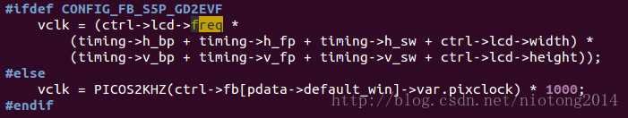

> 由于最近面试需要，特此整理一下LCD驱动的调试，因为之前在公司调试的RK平台下的LCD已经忘记了，所以以我手中现有的友善之臂tiny4412为例。先了解下LCD有关的知识吧。

[LCD基础知识连接](http://blog.csdn.net/xubin341719/article/details/9125583)

LCD常用接口TTL（RGB）、LVDS、EDP、MIPI，我个人理解就是从ARM中出来的是RGB接口的，本来这个可以直接用于显示到LCD屏，但由于抗干扰等等因素所以需要先将RGB数据通过芯片（转换芯片）转换，然后对应的(LCD屏中有对应的IC再将数据转换成RGB数据用于显示）

ARM                           ---------      LCD    （TTL）
ARM+转换芯片           --------      转换芯片+LCD	（LVDS，EDP，MIPI）
总体上将什么接口的重要性不大，一般也不会去调试这个。之前做过的RK的就是LVDS接口的，调试LCD驱动的时候就是根据RK提供的文档以及对应的LCD显示屏供应商提供的文档，修改dts中的有关时序等参数就可以了。

> 以下是TFT屏时序图

参数介绍：
VSYNC：帧同步信号（又称为垂直同步信号）。每发送一个脉冲，表示新的一屏图像数据开始传送。
HSYNC：行同步信号（又称为水平同步信号）。每发送一个脉冲，表示新的一行数据开始传送。
VDEN：数据使能信号。
VD[23:0]：LCD像素数据输出端口。共24个引脚，最多表示24位颜色值。
VCLK：像素时钟信号。每发送一个脉冲，表示新的一个点的数据图像数据开始传送。
这五个参数可以在ARM芯片中找到。

VSPW：表示垂直同步脉冲的宽度，用行计算，对因驱动程序中的vsync_len(我个人理解为发送一个VSYNC相当于可以发送VSPW+1个HSYNC)。
VBPD：表示在一帧图像开始时帧同步信号（VSYNC）以后的无效行数，对应驱动中的upper_margin(我个人理解为发送一个VSYNC后有VBPD+1个HSYNC将被丢弃)。
VFPD：表示在一帧图像结束后帧同步信号（VSYNC）以前的无效行数，对应驱动中的lower_margin(我个人理解为发送一个VSYNC后，VBPD+1个HSYNC将被丢弃，LINEVAL+1个HSYNC将有效，之后的VFPD+1个HSYNC将被丢弃）。

HSPW：表示水平同步信号的宽度，用VCLK计算，对应驱动中的hsync_len(我个人理解为发送一个HSYNC要发送HSPW+1个VLCK）。
HBPD：表示从水平同步信号开始到一行的有效数据开始之间的VCLK的个数，对应驱动中的right_margin。
HFPD：表示一行的有效数据结束之后到下一个HSYNC开始之前之间的VCLK的个数，对应驱动中的left_margin。

LINEVAL：垂直显示尺寸-1，即（800x480的显示屏的480-1）
HOZVAL：水平显示尺寸-1，即（800x480的显示屏的800-1）

总结就是：
（VSPW+1）+（VBPD+1）+（LINEVAL+1）+（VFPD+1）个HSYNC
（HSPW+1）+(HBPD+1)+(HOZVAL+1)+(HFPD+1)个VCLK

我开发板的使用的是S702的LCD屏，参数如下

可以至少看出LINEVAL = 480-1 = 479 HOZVAL = 800-1 =799 。
One Horizontal Line = Horizontal Display Area + HS Blanking + HS Front Porch
VS period time = Vertical Display Area + VS Blanking + VS Front Porch

来看下tiny4412-lcds.c中的lcd参数的配置

然后看下wvga_s70对应的配置

查看源码可以找到

然后在芯片的datashell中可以找到如下

综上可知
VSPW+1 = v_sw = 8
VBPD+1 = v_bp = 15
VFPD+1 = v_fp = 22
HOZVAL +1 = width = 800

HSPW +1 = h_sw = 10
HBPD+1 = h_bp = 36
HFPD+1 = h_fp = 80
LINEVAL+1 = height = 480
freg = 63

