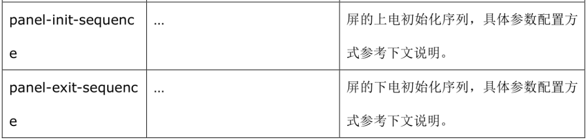
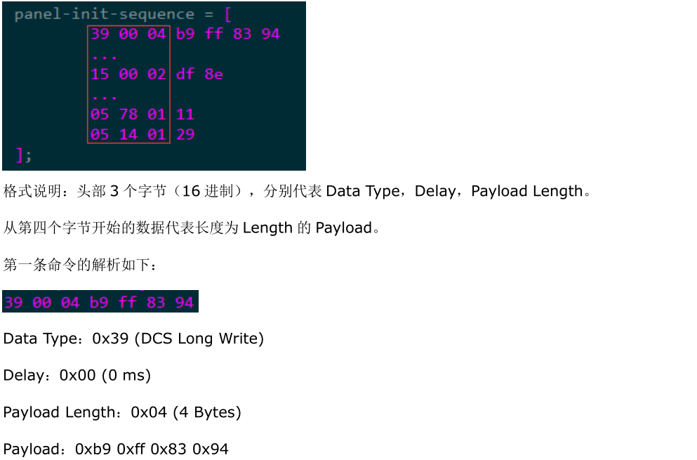
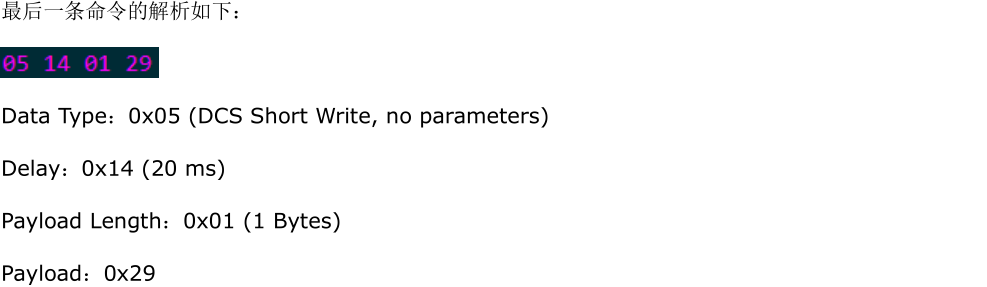
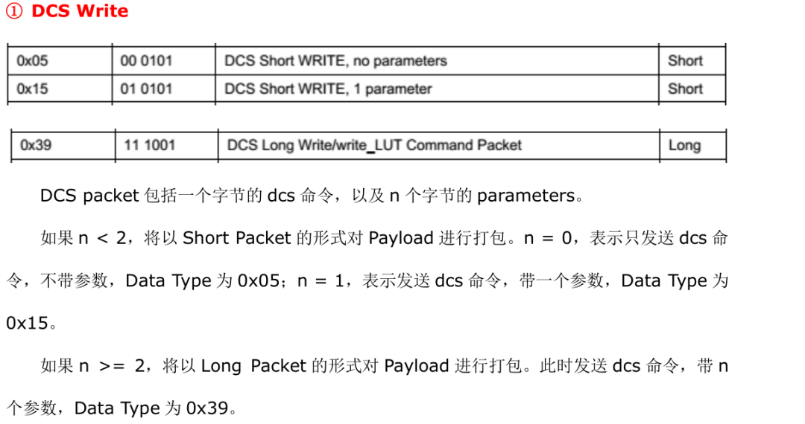
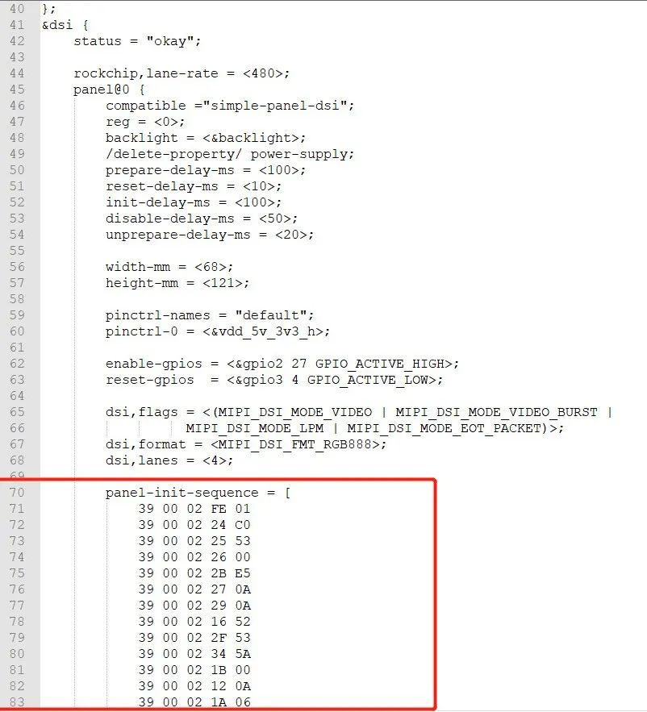
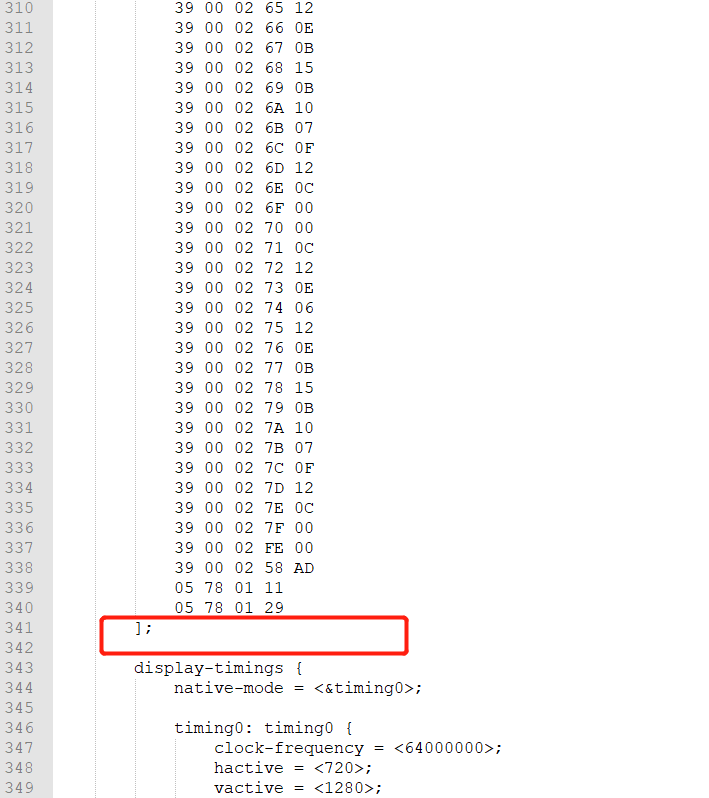

# MIPI DSI的配置

原文：[https://developer.aliyun.com/article/1326391](https://developer.aliyun.com/article/1326391)

## 1、MIPI LCD初始化序列描述

在上一篇文章中，我们看到荣品的屏设备树中有这么一段代码，但是里面的数据是什么含义呢？

```
panel-init-sequence = [
05 78 01 11
05 78 01 29
];
```

今天来详细记录下我学习在设备树中适配MIPI-DSI LCD初始化代码的详细过程。Linux提供了配置初始化代码的接口，相应的设备树也就支持了,这部分在内核的文档里有写：

> kernel/Documentation/devicetree/bindings/display/panel/simple-panel.txt

这个文档里简单描述了一下：

```
- panel-init-sequence:
- panel-exit-sequence:
A byte stream formed by simple multiple dcs packets.
byte 0: dcs data type
byte 1: wait number of specified ms after dcs command transmitted
byte 2: packet payload length
byte 3 and beyond: number byte of payload
```

翻译过来大概的意思是：

```
初始化序列
退出序列
由简单的多个dcs数据包形成的字节流
第0个字节：dcs数据类型
第1个字节：发送dcs命令后等待指定的毫秒数
第2个字节：数据包有效载荷长度
第3个字节及以后：有效载荷的字节数
```

一般情况下LCD屏会有初始化和反初始化的过程，但是在实际应用中，一般还很少会用到反初始化，所以LCD面板厂家一般都是只提供初始化代码，在MIPI DSI驱动中，我们需要将这些厂家提供的初始化代码转换为相应的DCS序列，关于初始化序列和退出序列的描述，由于我用的平台是瑞芯微，瑞芯微提供的技术文档也有相应的描述：

**具体参数配置方法，查看原厂瑞芯微给的文档的案例描述：**


**关于 DCS 类型是怎么来理解的，瑞芯微文档中也可以看到对它的描述:**

**个人的理解方法：**

如果只有一个数据，对应的命令类型是0x05;如果有两个数据，对应的命令类型是0x15；如果多于两个数据，对应的命令类型是0x39。

## 2、具体的配置方法(举例)

最近由于需要调试MIPI接口的LCD显示屏，然而我已经很久没调过驱动了；厂家给了我下面这一段初始化代码，我一看一脸懵逼，对于好多年没搞驱动的我不免觉得有点心虚，怕是月底验收任务的时候要被扣KPI了，厂商的初始化代码如下：

```
SET_GENERIC(0x02);
W_D(0x80);W_D(0xAB);
SET_GENERIC(0x02);
W_D(0x81);W_D(0x4B);
SET_GENERIC(0x02);
W_D(0x82);W_D(0x84);
SET_GENERIC(0x02);
W_D(0x83);W_D(0x88);
SET_GENERIC(0x02);
W_D(0x84);W_D(0xA8);
SET_GENERIC(0x02);
W_D(0x85);W_D(0xE3);
SET_GENERIC(0x02);
W_D(0x86);W_D(0xB8);
SET_GENERIC(0x02);
W_D(0x87);W_D(0x5A);
SET_GENERIC(0x02);
W_D(0xB1);W_D(0x38);
SET_GENERIC(0x01);
W_D(0x11);
delay_ms(120);
SET_GENERIC(0x01);
W_D(0x29);
```

那么这个初始化代码是什么含义呢？厂家一般不会告诉我，也不会给我提供寄存器手册，因为那是他们的知识产权，所以我也没必要知道他们到底设置了什么东西，我只需要知道它们就是协助我点屏的重要步骤之一就可以了。

我们就简单的认为这个初始化代码包含三类指令，分别是：

* SET_GENERIC
* W_D
* delay_ms

不同厂家提供的初始化代码是不同的，但格式基本上都是大同小异，有的初始化代码很少，也有的超级长，比如荣品的设备树里就有一个更长的，如下所示，这个是已经将初始化代码转换为DCS格式的了：


可见有些LCD面板厂家提供的初始化代码也是很多的，所以搞这个真的还是要有点耐心的，否则很容易出错，一旦出错，可能屏幕都点不亮。以上只是举一个简单的例子，我们需要将上面厂家给我的初始化命令转化成对应的DCS格式，然后添加到设备树的初始化序列里，这样驱动在加载的时候才能够被正确识别到。

> 既然要将初始化代码转换成DCS格式，那么就衍生出下面的步骤：

* 数个数

以SET_GENERIC为开始，下一个SET_GENERIC(不包含这次的SET_GENERIC和Delay)为结束作为一次数据发送，数一数一共有几个数据。

* 看时延

看看厂家提供的初始化代码里面有没有延时。
确定了以上步骤以后，我们就需要将初始化代码改写成下面的格式：

> 命令类型+延时数量+数据长度+数据

### 2.1、普通序列

> SET_GENERIC(0x02);
> W_D(0x80);W_D(0xAB);

如上，有三个数据，所以命令类型为39，所以第一个序列要这么写：

> 以下每一个字节一一进行对应：
> 命令类型 延时数量 数据长度 数据1 数据2 数据3
> 39 00 03 02 80 AB

### 2.2、带延时的序列

> SET_GENERIC(0x01);
> W_D(0x11);
> delay_ms(120)；

如上，有两个数据，1个延时，所以命令类型为15，所以带延时的序列要这么写：

> 以下每一个字节一一进行对应：
> 命令类型 延时数量(转16进制) 数据长度 数据1 数据2
> 15 78 02 01 11

### 2.3、将厂家给的序列转换为DCS格式序列

以此类推，从厂家给我们的初始化代码转换为序列就是：

```
39 00 03 02 80 AB
39 00 03 02 81 4B
39 00 03 02 82 84
39 00 03 02 83 88
39 00 03 02 84 A8
39 00 03 02 85 E3
39 00 03 02 86 B8
39 00 03 02 87 5A
39 00 03 02 B1 38
15 78 02 01 11
15 00 02 01 29
```

所以在设备树里的初始化序列就应该这么写，把上面转换的结果复制到下面来：

```
panel-init-sequence = [
39 00 03 02 80 AB
39 00 03 02 81 4B
39 00 03 02 82 84
39 00 03 02 83 88
39 00 03 02 84 A8
39 00 03 02 85 E3
39 00 03 02 86 B8
39 00 03 02 87 5A
39 00 03 02 B1 38
15 78 02 01 11
15 00 02 01 29
];
```

所以我们就不难理解以上荣品的DTS里初始化序列的含义：

```
panel-init-sequence = [
05 78 01 11
05 78 01 29
];
```

第一行：

* 05表示DCS命令类型，表示只有一个数据。
* 78表示延时时间为(0x78)=> 120ms
* 01表示指令的数据长度只有一个字节
* 11表示的就是数据

同理，第二行也是一样的理解，到这里我们就彻底的掌握了设备树关于初始化序列的配置方法了，如果想详细了解驱动代码里是怎么实现的，那么也可以去追一追代码，我觉得这种实现模式太优秀了，不得不说Linux内核实现的DSI驱动设计思想真的很棒！

