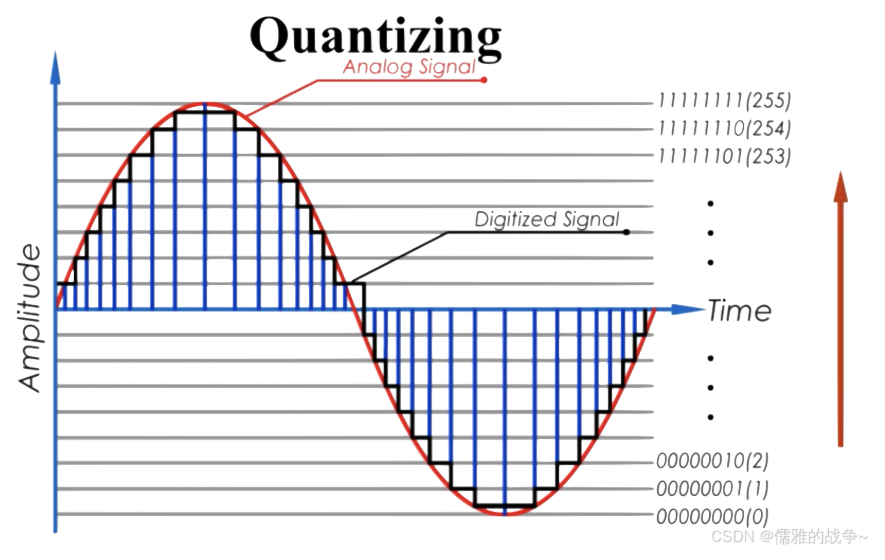
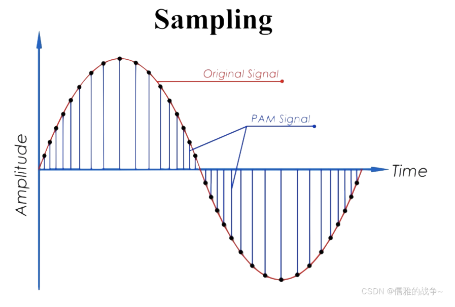
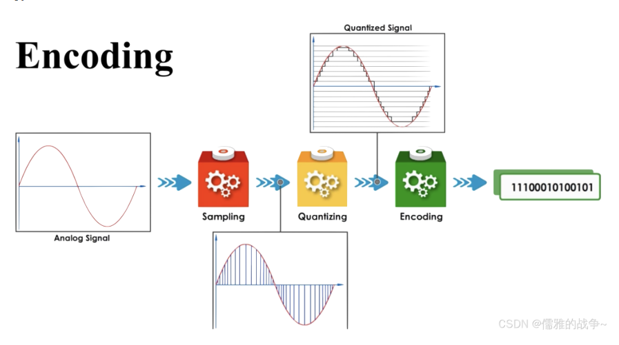
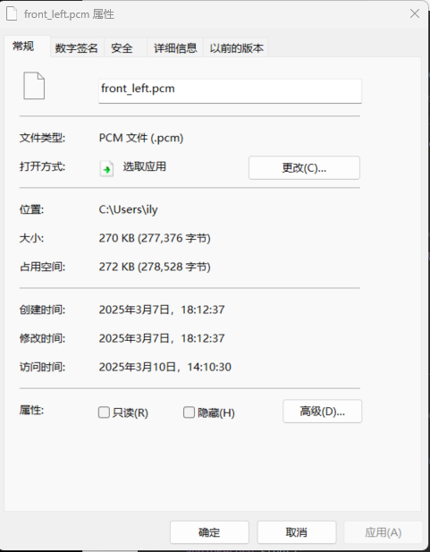
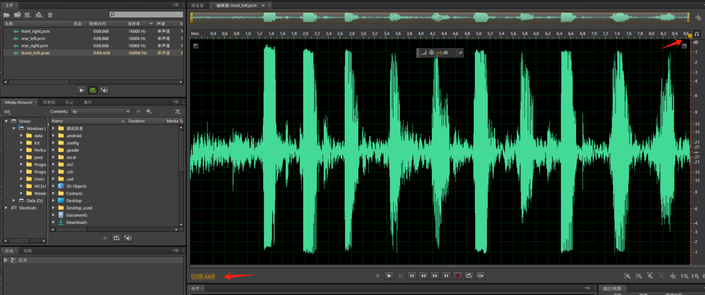

# PCM的大小计算

## 概述

**PCM是Pulse Code Modulation的缩写，中文名称为脉冲编码调制。这是一种将模拟信号转换成数字信号的技术，广泛应用于音频和电信领域。**

在音频领域，PCM通过固定的频率对模拟信号进行采样，然后将采样的信号量化，并输出一串连续的幅值不一的脉冲。这些脉冲的幅值按一定的精度进行量化，量化后的数值被连续地输出、传输、处理或记录到存储介质中，形成数字音频。

所以PCM生成需要经过 **采样(Sampling)**、**量化(Quantization)**、**编码(Encoding)**。

## 采样(Sampling)

采样就是将模拟信号的音频转换成数字信号音频的过程，通过模/数转换器（A/D）对声波进行采样，每一次采样都记录下了原始模拟声波在某一时刻的状态，称之为样本，将一串的样本连接起来，就可以描述一段声波。把每一秒钟所采样的次数称为采样频率，单位为HZ（赫兹）。其实，采样就是在时间轴上对信号进行数字化。

采用过程如上图，用若干个黑点来表示红色的曲线。红色的曲线是音频模拟信号，各个黑点就是样本。

采样率：每一秒钟所采样的样本个数；如果每秒所采集的样本越多，越能精确的表示曲线。常见的采样率有：通话时的采样率为8KHz(每秒8000个样本)，常用的媒体采样率有44.1KHz(每秒44100个样本)，更高要求的有48KHz(每秒48000个样本)等等。

## 量化(Quantization)

量化就是为采集的样本确定一个取值范围。
比如用16比特的二进制信号来表示声音的一个样本， 而16比特（一个short） 所表示的范围是[-32768,32767]， 共有65536个可能取值， 因此最终音频的数字信号在幅度上也分为了65536层。

如果用8比特的二进制信号来表示声音的一个样本，8比特(一个unsigned char)所表示的范围是[0,255]，共有256个层级。

注意：

在8位的PCM音频数据中，样本的取值范围是从0到255。对于有符号的8位PCM编码，取值范围为-128到127。每个样本使用一个8位字节来表示其幅度值，其中最低位（LSB）表示0，最高位（MSB）表示255。这种编码方式使得正负幅度能够均匀地分布在取值范围内，方便存储和处理。如果没有明确指定是有符号还是无符号的情况下，通常默认为无符号的0到255取值范围。

在16位PCM音频数据中，样本的取值范围是-32768到32767。16位PCM音频数据使用两个字节（16个比特）来表示每个样本的取值，其中一个比特用于表示正负号（16位中最高位为符号位）。因此，样本的取值范围可以表示为从− 2 15 -2^{15}−2
15
(-32768)到2 15 2^{15}2
15
-1(32767)。这个范围与8位PCM音频数据的取值范围不同，因为它们使用了不同数量的比特来表示每个样本的取值。

## 编码(Encoding)

编码， 就是按照一定的格式记录采样和量化后的样本数据，将量化后的数字信号转换为二进制码的过程。比如顺序存储或压缩存储， 等等。

采样、量化后的数据经过编码后产生的二进制数据，就是PCM数据。

## PCM音频的特征或参数

采样率（Sampling Rate）：表示每秒钟采样的样本数量，单位为赫兹（Hz）。它决定了PCM音频的时间分辨率和频率范围。
位深度（Bit Depth）：表示每个样本的取值精度，通常以位数表示。它决定了PCM音频的动态范围和信噪比。一般为16bit。
字节序（Byte Order）：表示多字节数据在存储或传输中的排列顺序。常见的字节序有大端序（Big Endian）和小端序（Little Endian）两种。常见的为小端字节序。
采样数据是否有符号（Signed or Unsigned Samples）：表示每个样本的取值是否包含符号位。有符号PCM样本的取值范围涵盖正负值，而无符号PCM样本的取值范围仅包含非负值。
声道数（Number of Channels）：表示PCM音频中的独立声道数量。常见的声道数有单声道（Mono）和立体声（Stereo），还可以有更多声道如5.1声道、7.1声道等。
这些参数共同定义了PCM音频的基本特征，对于处理、存储和传输PCM音频非常重要。不同的应用场景和需求可能需要不同的参数设置来满足特定的要求。

原文链接：[https://blog.csdn.net/m0\_57124501/article/details/142599845](https://blog.csdn.net/m0_57124501/article/details/142599845)

有一个采样率为16000 位深度为16bit  单通道文件，这个文件的大小为277376字节

用adobe Audition看这个文件如下图

这个音频的声音大小为8.668秒
所以计算公式是
采样率   x   位深度   x 采样时间    /   8(bit/byte)  = 文件大小单位字节
16000   x    16         x  8.668     /      8    =    277376字节
刚好可以对应上

