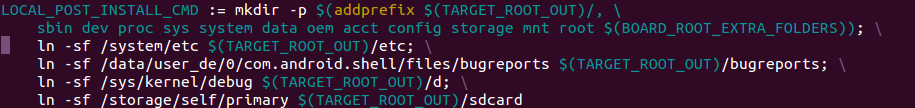

烧录android的固件之后，在根目录下有/sbin /sys /system /dev/ proc /data /mnt /root等目录，想添加一个新的目录，那么得弄清楚这些目录都是怎样生成的，查看代码android/system/core/rootdir/Android.mk的124行左右，有如下图这样的

修改这里添加你想添加的目录，这样最终编译完之后out/target/product/xxxxxx/root/目录下就多了你想添加的目录。

