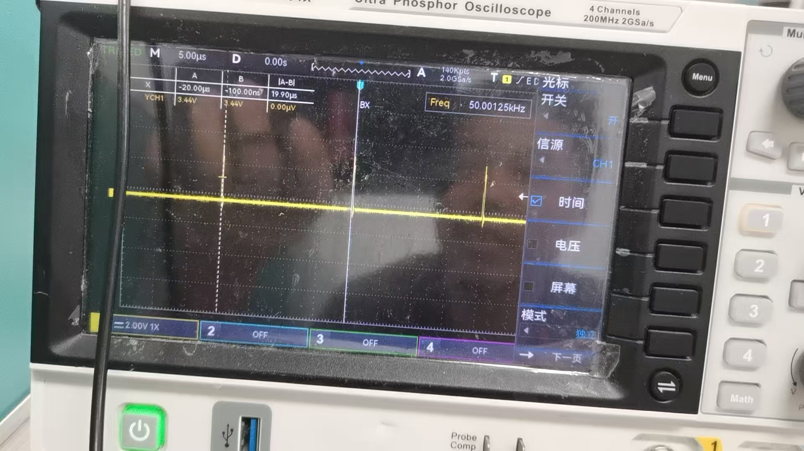

# B810背光控制的一些问题

客户那边反馈b810背光控制不线性，然后apk这边设置背光为0的时候，开发板还是有背光

## 初步判断

因为之前有客户使用A133 tina5.0的sdk也碰到过类似的问题，通过节点/dev/disp节点ioctl然后背光也是无法关闭的，最后发现是board.dts中如下配置导致的

```
lcd0: lcd0@01c0c000 {
    lcd_bl_0_percent    = <15>;
    lcd_bl_100_percent    = <100>;
}
```

但是当前B810这个客户dts中并没有这一块的配置,也就是并不是这个原因导致的，然后android系统层这边`frameworks/base/core/res/res/values/config.xml`中配置`config_screenBrightnessSettingMinimum`这个配置的值，这个配置是系统为了防止用户将背光设置为0然后屏幕完全黑屏，导致后续用户无法看清楚屏幕调整回来。
经过客户验证 该问题并不是这个原因导致的（实际上eink自己有一套背光控制的逻辑）

## 继续分析

让客户拉动背光亮度控制调到0-100，然后对应`cat   /sys/class/backlight/eink/brightness`,当控制条为0的时候值为255，当控制条为100的时候值为1.按道理讲/sys/class/backlight/eink/brightness值的范围应该是0-255.客户那边描述背光是最暗的，但是并没有完全灭掉，示波器测量显示还是有点占空比的

同时发现B810的sdk中uboot和kernel都没有对于pwm极性控制相关的代码（另外提供了补丁解决这个问题）

通过不断的追踪代码最后定位到`android/hardware/aw/lights/aidl/src/LightsDevice.cpp`背光的亮度是由于这个地方设置的。

```
static int rgb_to_brightness(struct light_state_t const *state)
{
    int color = state->color & 0x00ffffff;
    return ((77 * ((color >> 16) & 0x00ff))
        + (150 * ((color >> 8) & 0x00ff)) +
        (29 * (color & 0x00ff))) >> 8;
}

static int set_light_backlight(struct DeviceInfo *device,
                   struct light_state_t const *state)
{
    int brightness = rgb_to_brightness(state);
    int err = 0;
#ifdef USE_EINK_BACKLIGHT
    char buffer[20];
    pthread_mutex_lock(&device->g_lock);
    int bytes = sprintf(buffer, "%d\n", brightness);
    err = write(device->fd, &buffer, bytes);
    if (err == bytes)
        err = 0;
    else
        ALOGE("set backlight fail!:%s", strerror(errno));
#else
    unsigned long args[3];
    int i = 0;
    pthread_mutex_lock(&device->g_lock);
    for (i = 0; i < 2; i++) {
        args[0] = i;
        if (ioctl(device->fd, DISP_GET_OUTPUT_TYPE, args) ==
            DISP_OUTPUT_TYPE_LCD) {
            args[1] = brightness;
            args[2] = 0;
            err = ioctl(device->fd, DISP_LCD_SET_BRIGHTNESS, args);
            if (err < 0) {
                ALOGE("failed set brightness. %s.", strerror(errno));
            }

            break;
        }
    }

#endif

    pthread_mutex_unlock(&device->g_lock);
    return err;
}
```

原因就在于rgb_to_brightness（）的返回值范围是1-255.且我发现背光控制条的进度和/sys/class/backlight/eink/brightness的值非线性，因为客户那边apk直接操作/sys/class/backlight/eink/brightness，所以后续我就没有去深究了。
这个rgb_to_brightness()的算法实际上就是讲ARGB的数据转换成Y8的数据。（之前弄奥翼的彩色显示屏在uboot阶段无法显示彩色这个问题的时候处理过），如下是`longan/brandy/brandy-2.0/u-boot-2018/drivers/video/sunxi/common/eink_v2.c`中主要修改的代码（将bmp的图像数据从RGB格式转换成Y8格式）

```
if (p_rgb->bpp == 8) {
		/* Output format is Y8, convert from RGB to grayscale */
		for (y = 0; y < src_height / 2; y++) {
			dst_pixel = dst_addr_b + (y * 2) * p_rgb->stride;
			src_pixel = src_addr + (y * 2) * src_stride;

			for (x = 0; x < src_width / 2; x++) {
				unsigned char r, g, b, a;

                /*奥翼屏的顺序是ABRG*/
				if (bmp->header.bit_count == 24) {
					/* BMP format: B, G, R */
					b = *(unsigned char *)src_pixel;
					g = *(unsigned char *)(src_pixel + 1);
					r = *(unsigned char *)(src_pixel + 2);
                    a = 0x7f;
                    *dst_pixel = a;
                    *(dst_pixel + 1) = b;
                    *(dst_pixel + p_rgb->stride) = r;
                    *(dst_pixel + p_rgb->stride + 1) = g;
					src_pixel += (3 * 2);
				} else if (bmp->header.bit_count == 32) {
					/* BMP format: B, G, R, A */
					b = *(unsigned char *)src_pixel;
					g = *(unsigned char *)(src_pixel + 1);
					r = *(unsigned char *)(src_pixel + 2);
					a = *(unsigned char *)(src_pixel + 3);
                    *dst_pixel = a;
                    *(dst_pixel + 1) = b;
                    *(dst_pixel + p_rgb->stride) = r;
                    *(dst_pixel + p_rgb->stride + 1) = g;
					src_pixel += (4 * 2);
				} else {
					/* Initialize with default values to avoid compiler warning */
					r = g = b = a = 0;
                    *dst_pixel = b;
                    *(dst_pixel + 1) = g;
                    *(dst_pixel + p_rgb->stride) = r;
                    *(dst_pixel + p_rgb->stride + 1) = a;
					src_pixel += 4; /* Safe advance */
				}

				/* RGB to Y8 conversion using standard formula:
				 * Y8 = 0.299*R + 0.587*G + 0.114*B
				 * Using integer approximation: Y8 = (77*R + 150*G + 29*B) >> 8
				 */
				dst_pixel = dst_pixel + 2;
			}
		}
	}
```

