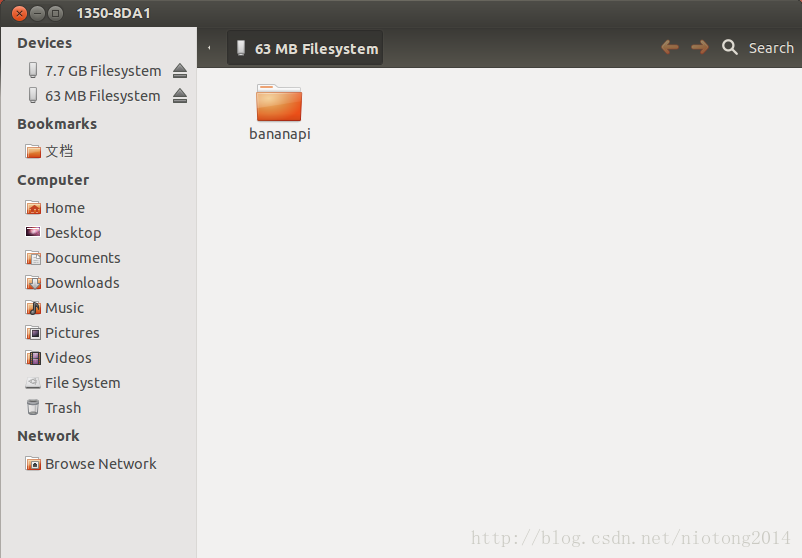
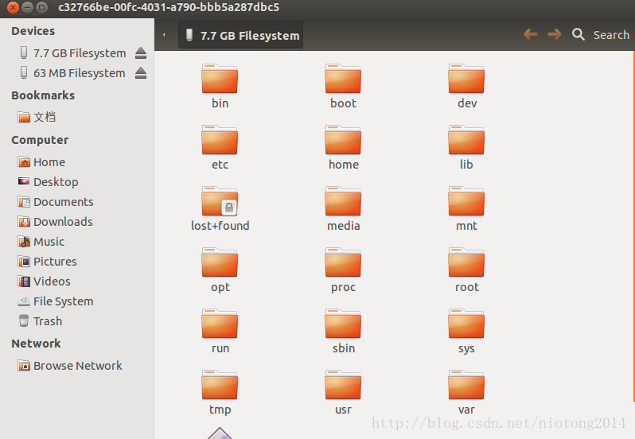

**1.体验Linux**
手头上刚刚好有一块banana-pi，所以想试试Linux，首先在官网下载了个ArchLinux[镜像和制作SD卡工具的下载路径](https://www.banana-pi.org.cn/download.html)，先使用SD Formatter这个工具格式化SD卡，然后用Win32DiskImager来制作启动卡，接着将SD卡插入M3，连上HDMI，启动就可以看到系统启动，当然，你也可以将XXXX.img放入U盘（如果你启动卡有足够的空间也可以放入到启动卡），mount命令挂载U盘，然后将该img使用dd命令烧到mmc中（我的mmc的设备节点为/dev/mmcblk1，mmcblk0为我的启动卡），然后断电，拔掉SD卡，就可以看到系统从mmc启动。
**2.下载M3的代码**
M3仓库地址(https://github.com/BPI-SINOVOIP/BPI-M3-bsp.git)，从仓库中下载代码，你可以先看REAME.md。allwinner-tools目录为bpi提供的交叉编译工具，build.sh为编译脚本，configure为环境变量的配置，linux-sunxi为内核源码，Makefile你懂的，rootfs为文件系统，scripts目录里面放了脚本，sunxi-pack里面有些配置，u-boot-sunxi为bootloader的源码。
**3.编译**
首先修改Makefile

```
CROSS_COMPILE=$(COMPILE_TOOL)/arm-linux-gnueabi-
#CROSS_COMPILE=arm-linux-gnueabi-
NEW_CROSS_COMPILE=$(NEW_COMPILE_TOOL)/arm-linux-gnueabihf-
#NEW_CROSS_COMPILE=arm-linux-gnueabihf-
U_CROSS_COMPILE=$(CROSS_COMPILE)
K_CROSS_COMPILE=$(CROSS_COMPILE)
#K_CROSS_COMPILE=$(NEW_CROSS_COMPILE)
```

作如上修改，修改

> NEW_ CROSS_COMPILE=arm-linux-gnueabi-

为

> NEW_CROSS_COMPILE=$(NEW_COMPILE_TOOL)/arm-linux-gnueabihf-

这是因为我编译的时候会报关于找不到编译器的问题。
修改

> K_CROSS_COMPILE=$(NEW_CROSS_COMPILE)

为

> K_CROSS_COMPILE=$(CROSS_COMPILE)

这是因为由于编译kernel的编译器不对造成我后面发现自己编译的内核无法运行。

然后执行./build.sh这个脚本，然后根据提示的选项就可以编译了，这里我选“1. Build all, uboot and kernel and pack to download images.“，然后就静侯编译完成了。(PS:我的系统是ubuntu 12.04 64位)
**4.制作SD启动卡**
首先使用fdisk来对sd卡进行分区，分区的大小在scripts/dd_download.sh这个脚本中有描述

```
# make partition table by fdisk command
# reserve part for fex binaries download 0~204799
# partition1 /dev/sdc1 vfat 204800~327679
# partition2 /dev/sdc2 ext4 327680~end
```

设置分区的文件格式使用命令

```
mkfs.vfat /dev/sdX1
mkfs.ext4 /dev/sdX2
```

执行scripts中的脚本dd_download.sh

```
./dd_download.sh /dev/sdX
```

然后将SD/BPI-BOOT中的内容拷贝到sd卡的分区一中，将SD/BPI-ROOT中的内容拷贝到sd卡的分区二中，你会发现SD/BPI-ROOT中只有lib和usr这两个文件价，显然这不是标准的文件系统，所以从bpi的官方仓库哪里下载一个文件系统仓库地址为（https://github.com/BPI-SINOVOIP/BPI-files.git），比如我下载的是busybox-1.24.2_bash-root.tgz然后解压将内容也拷贝到sd卡的分区二中，lib和usr中的内容，我选择的是合并。最后给你们看下制作好的SD卡的目录结构




**5.烧录镜像到emmc**
从SD卡启动之后，自行使用fdisk mount umount dd 等命令自行将镜像文件等烧录或复制到EMMC中
**6.bpi-tools的使用**
[bpi-tools的说明文档](http://forum.banana-pi.org/t/how-to-use-bpi-update-command-to-update-kernel-image/2631)

```
git clone https://github.com/BPI-SINOVOIP/bpi-tools.git
cd bpi-tools
sudo ./bpi-tools -u -U
```

我只执行了上面三个命令，SD/100MB目录下的文件是制作启动卡的文件。

```
cd SD/100MB
sudo bpi-bootsel BPI_M3_720P.img.gz /dev/sdX
```

上面这个命令和dd_download.sh这个脚本的功能貌似一样。还可以执行

```
sudo bpi-update -d /dev/sdX
```

这样会自动把编译好的uImages kernel通通复制到SD卡中（这个我没有验证，你们自行尝试）。

