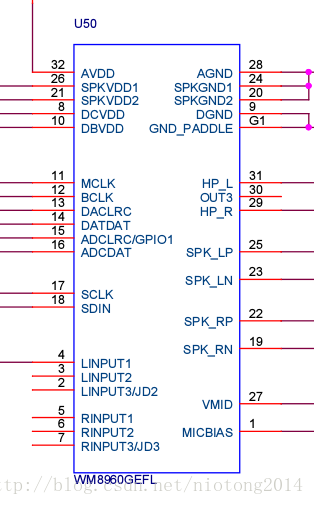
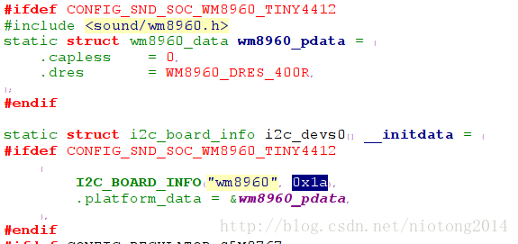
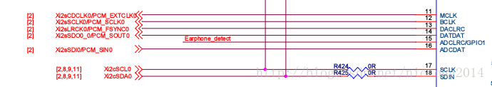

> 之前在公司做过cs42l52编解码器的驱动，不过现在已然已经忘记了。目前手中有友善之臂的一款三星4412的开发板，那么就分析这款产品的音频编解码器吧。




如图所示，可以看出该开发板使用的是WM8960的音频编解码器，查找源码android-5.0.2/linux-3.0.86/sound/soc/codecs/wm8960.c存在，查看mach-tiny4412.c可以看到如下图

很显然可以看到wm8960音频编解码器的i2c地址是0x1a,其I2C连线如下图


也就是该设备还是一个i2c设备，现在来看它的代码
模块入口：

```
module_init(wm8960_modinit);
```

初始化函数：

```
static int __init wm8960_modinit(void)
{
	int ret = 0;
#if defined(CONFIG_I2C) || defined(CONFIG_I2C_MODULE)
	ret = i2c_add_driver(&wm8960_i2c_driver);
	if (ret != 0) {
		printk(KERN_ERR "Failed to register WM8960 I2C driver: %d\n",
		       ret);
	}
#endif
	return ret;
}
```

对应的wm8960_i2c_driver数据

```
static struct i2c_driver wm8960_i2c_driver = {
	.driver = {
		.name = "wm8960-codec",
		.owner = THIS_MODULE,
	},
	.probe =    wm8960_i2c_probe,
	.remove =   __devexit_p(wm8960_i2c_remove),
	.id_table = wm8960_i2c_id,
};
```

一旦探测到设备执行wm8960_i2c_probe函数

```
static __devinit int wm8960_i2c_probe(struct i2c_client *i2c,
				      const struct i2c_device_id *id)
{
	struct wm8960_priv *wm8960;
	int ret;

	wm8960 = kzalloc(sizeof(struct wm8960_priv), GFP_KERNEL);
	if (wm8960 == NULL)
		return -ENOMEM;

	i2c_set_clientdata(i2c, wm8960);
	wm8960->control_type = SND_SOC_I2C;
	wm8960->control_data = i2c;

	ret = snd_soc_register_codec(&i2c->dev,
			&soc_codec_dev_wm8960, &wm8960_dai, 1);
	if (ret < 0)
		kfree(wm8960);
	return ret;
}
```

显然最重要的是snd_soc_register_codec(&i2c->dev,
&soc_codec_dev_wm8960, &wm8960_dai, 1);这一句了

```
static struct snd_soc_codec_driver soc_codec_dev_wm8960 = {
	.probe =	wm8960_probe,
	.remove =	wm8960_remove,
	.suspend =	wm8960_suspend,
	.resume =	wm8960_resume,
	.set_bias_level = wm8960_set_bias_level,
	.reg_cache_size = ARRAY_SIZE(wm8960_reg),
	.reg_word_size = sizeof(u16),
	.reg_cache_default = wm8960_reg,
};


static int wm8960_probe(struct snd_soc_codec *codec)
{
	struct wm8960_priv *wm8960 = snd_soc_codec_get_drvdata(codec);
	struct wm8960_data *pdata = dev_get_platdata(codec->dev);
	int ret;
	u16 reg;

	wm8960->set_bias_level = wm8960_set_bias_level_out3;
	codec->control_data = wm8960->control_data;

	if (!pdata) {
		dev_warn(codec->dev, "No platform data supplied\n");
	} else {
		if (pdata->dres > WM8960_DRES_MAX) {
			dev_err(codec->dev, "Invalid DRES: %d\n", pdata->dres);
			pdata->dres = 0;
		}

		if (pdata->capless)
			wm8960->set_bias_level = wm8960_set_bias_level_capless;
	}

	ret = snd_soc_codec_set_cache_io(codec, 7, 9, wm8960->control_type);
	if (ret < 0) {
		dev_err(codec->dev, "Failed to set cache I/O: %d\n", ret);
		return ret;
	}

	ret = wm8960_reset(codec);
	if (ret < 0) {
		dev_err(codec->dev, "Failed to issue reset\n");
		return ret;
	}

	wm8960->set_bias_level(codec, SND_SOC_BIAS_STANDBY);

	/* Latch the update bits */
	reg = snd_soc_read(codec, WM8960_LINVOL);
	snd_soc_write(codec, WM8960_LINVOL, reg | 0x100);
	reg = snd_soc_read(codec, WM8960_RINVOL);
	snd_soc_write(codec, WM8960_RINVOL, reg | 0x100);
	reg = snd_soc_read(codec, WM8960_LADC);
	snd_soc_write(codec, WM8960_LADC, reg | 0x100);
	reg = snd_soc_read(codec, WM8960_RADC);
	snd_soc_write(codec, WM8960_RADC, reg | 0x100);
	reg = snd_soc_read(codec, WM8960_LDAC);
	snd_soc_write(codec, WM8960_LDAC, reg | 0x100);
	reg = snd_soc_read(codec, WM8960_RDAC);
	snd_soc_write(codec, WM8960_RDAC, reg | 0x100);
	reg = snd_soc_read(codec, WM8960_LOUT1);
	snd_soc_write(codec, WM8960_LOUT1, reg | 0x100);
	reg = snd_soc_read(codec, WM8960_ROUT1);
	snd_soc_write(codec, WM8960_ROUT1, reg | 0x100);
	reg = snd_soc_read(codec, WM8960_LOUT2);
	snd_soc_write(codec, WM8960_LOUT2, reg | 0x100);
	reg = snd_soc_read(codec, WM8960_ROUT2);
	snd_soc_write(codec, WM8960_ROUT2, reg | 0x100);

	snd_soc_add_controls(codec, wm8960_snd_controls,
				     ARRAY_SIZE(wm8960_snd_controls));
	wm8960_add_widgets(codec);

	return 0;
}
```

在wm8960_probe这个函数中，我们可以看到一些写寄存器的操作，这个就是对应的wm8960设备的初始值，具体寄存器设置来哪些初始值得结合datasheet来分析，之前公司弄的cs42l52也是这样的，当时为了调节从codec出来的音量大小，就是修改这个位置的参数来解决的。

```
static struct snd_soc_dai_driver wm8960_dai = {
	.name = "wm8960-hifi",
	.playback = {
		.stream_name = "Playback",
		.channels_min = 1,
		.channels_max = 2,
		.rates = WM8960_RATES,
		.formats = WM8960_FORMATS,},
	.capture = {
		.stream_name = "Capture",
		.channels_min = 1,
		.channels_max = 2,
		.rates = WM8960_RATES,
		.formats = WM8960_FORMATS,},
	.ops = &wm8960_dai_ops,
	.symmetric_rates = 1,
};

static struct snd_soc_dai_ops wm8960_dai_ops = {
	.hw_params = wm8960_hw_params,
	.digital_mute = wm8960_mute,
	.set_fmt = wm8960_set_dai_fmt,
	.set_clkdiv = wm8960_set_dai_clkdiv,
	.set_pll = wm8960_set_dai_pll,
};
```

这里面东西太多，得结合现实情况来分析。

