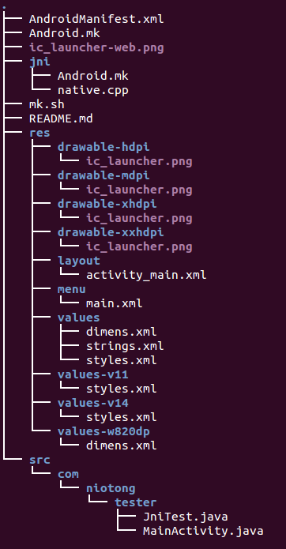

## JNI编程基本写法

- 创建android app项目
 )
  忽略res/文件夹下的adt生成的没什么用的东西。

> 编写MainActivity.java，代码如下：

```
public class MainActivity extends Activity implements OnClickListener{

	private EditText etValue1 ;
	private EditText etValue2 ;
	private TextView tvValue1 ;
	private TextView tvValue2 ;
	private Button equalsButton;
	private Button dojniButton;
	private double a = 100;
    @Override
    protected void onCreate(Bundle savedInstanceState) {
        super.onCreate(savedInstanceState);
        setContentView(R.layout.activity_main);
        etValue1 = (EditText) findViewById(R.id.editText1); // the first value
        etValue2 = (EditText) findViewById(R.id.editText2); // the second value
        tvValue1 = (TextView) findViewById(R.id.textView1);
        tvValue2 = (TextView) findViewById(R.id.textView2); // the result value
        equalsButton = (Button) findViewById(R.id.button1); // the = button
        dojniButton = (Button) findViewById(R.id.button2);
    
        equalsButton.setOnClickListener(this);
        dojniButton.setOnClickListener(this);
    }
	@Override
	public void onClick(View v) {
		// TODO Auto-generated method stub

		switch (v.getId()) {
		case R.id.button1:
			useJNItoAdd();
			break;
		case R.id.button2:
			doJNI();
			break;

		default:
			break;
		}
	}
	private void doJNI() {
		// TODO Auto-generated method stub
		JniTest.doJNI(this);//调用so库，然后so库中c再调用java
	}
	private void useJNItoAdd(){
		double a = 0, b = 0, c = 0;
		try {
			a = Double.valueOf(etValue1.getText().toString()).doubleValue();
			b = Double.valueOf(etValue2.getText().toString()).doubleValue();
		} catch (Exception e) {
			// TODO Auto-generated catch block
			e.printStackTrace();
		}
		c= JniTest.Jadd(a,b);//调用so库来相加
		tvValue2.setText(String.valueOf(c));
	}
}
```

> JniTest.java的代码如下：

```
public class JniTest {
	static{
		System.loadLibrary("JniTest");
	}
	private native static double add(double a,double b);
	private native static void doJNImethod(Object con);

	public static double Jadd(double a,double b){
		return add(a,b);
	}

	public static void doJNI(Object con){
		doJNImethod(con);
	}
}
```

然后可以进入eclipse的项目中的bin/文件中有存放class文件的classes目录下然后使用javah com.niotong.tester.JniTest 然后回生成一个.h文件这个文件中有对应so层的add和doJNImethod这两个方法的返回值和参数类型，照着这个参数类型写这个两个方法肯定是不会错的。

> native.cpp中代码如下，请仔细看代码以及注释

```
#define LOG_TAG "myjni native.cpp"
#include <utils/Log.h>

#include <stdio.h>

#include "jni.h"

//(DD)D
//这个方法是接受来自java层传过来的两个值然后相加返回给java层
static jdouble
add(JNIEnv *env, jobject thiz, jdouble a, jdouble b) {
double result = a + b;
    ALOGI("%lf + %lf = %lf", a, b, result);
    return result;
}

//(Ljava/lang/Object;)V
//这个方法主要是通过c来调用Java层的setText方法来给R.id.editText3这个EditText设置值
void doJNImethod(JNIEnv *env, jclass thizz,
		jobject thiz) {


	//获取R.id中的str1值
	jclass native_str1 = env->FindClass("com/niotong/tester/R$id");
	jfieldID fieldID_str = env->GetStaticFieldID(native_str1, "editText3", "I");
	jint str1 = env->GetStaticIntField(native_str1, fieldID_str);
	ALOGI("str is %d", str1);
	jclass native_str1_1 = env->FindClass("android/app/Activity");
	if (native_str1_1 == 0) {
		ALOGI("FindClass native_str1 error");
		return;
	}


	//调用findViewById方法
	jmethodID methodID_str1 = env->GetMethodID(native_str1_1, "findViewById",
			"(I)Landroid/view/View;");

	if (methodID_str1 == 0) {
		ALOGI("GetMethodID methodID_func error");
		return;
	}
	jobject str1_id = env->CallObjectMethod(thiz, methodID_str1, str1);

	jclass native_TextView = env->FindClass("android/widget/TextView");
	if (native_TextView == 0) {
		ALOGI("FindClass native_TextView error");
		return;
	}

	//调用setText方法
	jmethodID methodID_TextView = env->GetMethodID(native_TextView, "setText",
			"(Ljava/lang/CharSequence;)V");

	if (methodID_TextView == 0) {
		ALOGI("GetMethodID methodID_func error");
		return;
	}

	jstring text = env->NewStringUTF("yuanman");
	env->CallVoidMethod(str1_id, methodID_TextView, text);

	ALOGI("to here");
}
//
static const char *classPathName = "com/niotong/tester/JniTest";

//本地方法和java函数的映射对应
//结构是{java中的函数名字,描述函数的参数和返回值,c中的函数指针}
static JNINativeMethod methods[] = {
  {"add", "(DD)D", (void*)add },
  {"doJNImethod","(Ljava/lang/Object;)V",(void*)doJNImethod},
};

/*
 * Register several native methods for one class.
 */
//
static int registerNativeMethods(JNIEnv* env, const char* className,
    JNINativeMethod* gMethods, int numMethods)
{
    jclass clazz;

	//检查是否存在这个class
    clazz = env->FindClass(className);
    if (clazz == NULL) {
        ALOGE("Native registration unable to find class '%s'", className);
        return JNI_FALSE;
    }
	//开始注册本地方法
    if (env->RegisterNatives(clazz, gMethods, numMethods) < 0) {
        ALOGE("RegisterNatives failed for '%s'", className);
        return JNI_FALSE;
    }

    return JNI_TRUE;
}

/*
 * Register native methods for all classes we know about.
 *
 * returns JNI_TRUE on success.
 */
//
static int registerNatives(JNIEnv* env)
{
	//将本地方法注册到VM中，这么做的好处是调用native方法时查找得更快
  if (!registerNativeMethods(env, classPathName,
                 methods, sizeof(methods) / sizeof(methods[0]))) {
    return JNI_FALSE;
  }

  return JNI_TRUE;
}


// ----------------------------------------------------------------------------

/*
 * This is called by the VM when the shared library is first loaded.
 */
 
typedef union {
    JNIEnv* env;
    void* venv;
} UnionJNIEnvToVoid;

//当执行System.loadLibrary（）这个函数的时候首先执行这个这个方法
//对应JNI_OnLoad还有JNI_OnUnload这个方法
jint JNI_OnLoad(JavaVM* vm, void* reserved)
{
    UnionJNIEnvToVoid uenv;
    uenv.venv = NULL;
    jint result = -1;
    JNIEnv* env = NULL;
  
    ALOGI("JNI_OnLoad");

    if (vm->GetEnv(&uenv.venv, JNI_VERSION_1_4) != JNI_OK) {
        ALOGE("ERROR: GetEnv failed");
        goto bail;
    }
    env = uenv.env;

	//注册jni
    if (registerNatives(env) != JNI_TRUE) {
        ALOGE("ERROR: registerNatives failed");
        goto bail;
    }
  
    result = JNI_VERSION_1_4;
  
bail:
    return result;
}
```

以上代码需要注意的是 registerNativeMethods(本地方法和java函数的映射对应)这个方法，android的framework层很多都是这样写的，这样做好处有，1查找方法速度快，2函数方法好看易懂，没有javah生成的函数名那么丑。

> activity_main.xml代码如下

```
<LinearLayout 
    xmlns:android="http://schemas.android.com/apk/res/android"
    xmlns:tools="http://schemas.android.com/tools"
    android:id="@+id/container"
    android:layout_width="match_parent"
    android:layout_height="match_parent" 
    android:orientation="vertical">

   <LinearLayout
        android:layout_width="match_parent"
        android:layout_height="wrap_content"
        android:orientation="horizontal" >


        <EditText
            android:id="@+id/editText1"
            android:layout_width="wrap_content"
            android:layout_height="wrap_content"
            android:layout_weight="1"
            android:ems="10"
            android:inputType="number" 
            android:text="@string/defaultzero">

            <requestFocus />
        </EditText>


        <TextView
        android:id="@+id/textView1"
        android:layout_width="50dp"
        android:layout_height="50dp"
        android:gravity="center"
        android:text="@string/plus" />

        <EditText
            android:id="@+id/editText2"
            android:layout_width="wrap_content"
            android:layout_height="wrap_content"
            android:layout_weight="1"
            android:ems="10"
            android:inputType="number" 
            android:text="@string/defaultzero"/>

    </LinearLayout>


	<LinearLayout
        android:layout_width="match_parent"
        android:layout_height="wrap_content"
        android:orientation="horizontal" >
        <Button
        android:id="@+id/button1"
        android:layout_width="50dp"
        android:layout_height="wrap_content"
        android:text="@string/equals" />
    
   <TextView
       android:id="@+id/textView2"
       android:layout_width="match_parent"
       android:layout_height="50dp"
       android:gravity="center"/>
    </LinearLayout>
        <Button
        android:id="@+id/button2"
        android:layout_width="match_parent"
        android:layout_height="50dp"
        android:text="@string/dojni" />

        <EditText
            android:id="@+id/editText3"
            android:layout_width="match_parent"
            android:layout_height="wrap_content"
            android:ems="10"
            android:inputType="textMultiLine" />
  
</LinearLayout>
```

至此代码基本就是这些了。

> 顶层Android.mk代码如下

```
TOP_LOCAL_PATH:= $(call my-dir)
# Build activity
#$(shell rm $(LOCAL_PATH)/gen $(LOCAL_PATH)/bin)
LOCAL_PATH:= $(TOP_LOCAL_PATH)


include $(CLEAR_VARS)
LOCAL_MODULE_TAGS := optional
LOCAL_SRC_FILES := $(call all-subdir-java-files)
#生成JniTestApp.apk
LOCAL_PACKAGE_NAME := JniTestApp
LOCAL_CERTIFICATE := platform
#将libJniTest.so打包到apk中
LOCAL_JNI_SHARED_LIBRARIES := libJniTest
#作用自行百度
LOCAL_PROGUARD_FLAG_FILES := proguard.flags
#关闭代码优化，防止编译器将代码优化造成c调用java的方法抛出找不到java层对应方法的错误
LOCAL_PROGUARD_ENABLED := disabled
LOCAL_SDK_VERSION := current
include $(BUILD_PACKAGE)

# ============================================================

# Also build all of the sub-targets under this one: the shared library.
#这个会调用jni文件夹下的Android.mk
include $(call all-makefiles-under,$(LOCAL_PATH))
```

Android.mk基本上每一个include $(CLEAR_VARS)和include BUILD_PACKAGE可以看成一个函数。

> jni文件夹下Android.mk代码

```
LOCAL_PATH:= $(call my-dir)


include $(CLEAR_VARS)
LOCAL_MODULE_TAGS := optional
# This is the target being built.
#生成libJniTest.so
LOCAL_MODULE:= libJniTest
# All of the source files that we will compile.
LOCAL_SRC_FILES:= \
  native.cpp
# All of the shared libraries we link against.
LOCAL_SHARED_LIBRARIES := \
	libutils liblog
# No static libraries.
LOCAL_STATIC_LIBRARIES :=
# Also need the JNI headers.
LOCAL_C_INCLUDES += \
	$(JNI_H_INCLUDE)
# No special compiler flags.
LOCAL_CFLAGS +=
include $(BUILD_SHARED_LIBRARY)
```

基本上这就是整个jni编程的流程，仿照这种写法应该能够完成你想要的。（整个写法可以参照android源码提供的SimpleJni）
