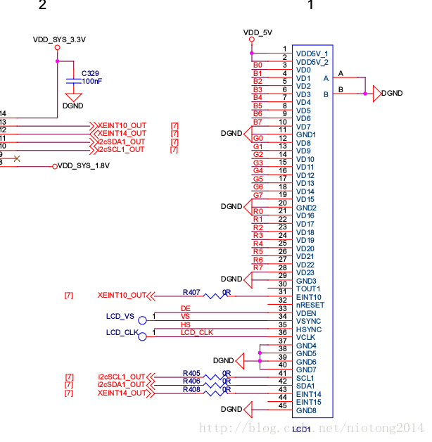

由于最近面试多次被问道驱动相关的东西，而tp驱动次数比较多，之前也没有怎么做过，但是还是有一些接触的。下面结合实际情况整理以下吧。（本人现有一款友善之臂的4412的开发板），通过adb shell，cat /proc/bus/input/devices，cat /dev/input/event0(根据实际情况分析具体是那个节点),最终确定tp的驱动deriver.name="ft5x0x_ts",然后去内核中确定源码是linux-3.0.86/drivers/input/touchscreen/ft5x06_ts.c

1.驱动加载

```
module_init(ft5x0x_ts_init);
```

调用ft5x0x_ts_init函数，作用是注册一个i2c驱动

```
static int __init ft5x0x_ts_init(void)
{
	return i2c_add_driver(&ft5x0x_ts_driver);
}
```

具体i2c怎么添加一个驱动就不管了，现在来看这个ft5x0x_ts_driver这个变量

```
static struct i2c_driver ft5x0x_ts_driver = {
	.probe		= ft5x0x_ts_probe,
	.remove		= __devexit_p(ft5x0x_ts_remove),
	.id_table	= ft5x0x_ts_id,
	.driver	= {
		.name	= FT5X0X_NAME,
		.owner	= THIS_MODULE,
	},
};
```

这个ft5x0x_ts_driver.driver.name = FT5X0X_NAME，就是之前cat /proc/bus/input/devices时看到的一个设备的NAME对应的值，主要分析是它的probe这个函数指针，这个就是i2c探测设备是否存在了。

probe函数内容具体如下，有注释

```
static int ft5x0x_ts_probe(struct i2c_client *client, const struct i2c_device_id *id)
{
	struct ft5x0x_i2c_platform_data *pdata;
	struct ft5x0x_ts_data *ts;
	struct input_dev *input_dev;
	unsigned char val;
	unsigned int ctp_id;
	int err = -EINVAL;

	ctp_id = tiny4412_get_ctp();
	if (ctp_id != CTP_FT5X06 && ctp_id != CTP_AUTO) {
		return -ENODEV;
	}

	if (!i2c_check_functionality(client->adapter, I2C_FUNC_I2C)) {
		err = -ENODEV;
		goto exit_check_functionality_failed;
	}

	ts = kzalloc(sizeof(*ts), GFP_KERNEL);
	if (!ts) {
		err = -ENOMEM;
		goto exit_alloc_data_failed;
	}

	pdata = client->dev.platform_data;
	if (!pdata) {
		dev_err(&client->dev, "failed to get platform data\n");
		goto exit_no_pdata;
	}
//设置ts相关的一些参数
	ts->screen_max_x = pdata->screen_max_x;
	ts->screen_max_y = pdata->screen_max_y;
	ts->pressure_max = pdata->pressure_max;
//此处感觉将gpio口当作中断来用
	ts->gpio_irq = pdata->gpio_irq;
	if (ts->gpio_irq != -EINVAL) {
		client->irq = gpio_to_irq(ts->gpio_irq);
	} else {
		goto exit_no_pdata;
	}
	if (pdata->irq_cfg) {
		s3c_gpio_cfgpin(ts->gpio_irq, pdata->irq_cfg);
		s3c_gpio_setpull(ts->gpio_irq, S3C_GPIO_PULL_NONE);
	}

	ts->gpio_wakeup = pdata->gpio_wakeup;
	ts->gpio_reset = pdata->gpio_reset;
//重要，初始化work_srturt,相当于一旦需要去处理这个工作任务，那么就调用ft5x0x_ts_pen_irq_work这个方法，后面会说明
	INIT_WORK(&ts->work, ft5x0x_ts_pen_irq_work);
	this_client = client;
	i2c_set_clientdata(client, ts);
//创建一个工作队列
	ts->queue = create_singlethread_workqueue(dev_name(&client->dev));
	if (!ts->queue) {
		err = -ESRCH;
		goto exit_create_singlethread;
	}
//下面设置input_dev相关参数，并且注册这个input设备
	input_dev = input_allocate_device();
	if (!input_dev) {
		err = -ENOMEM;
		dev_err(&client->dev, "failed to allocate input device\n");
		goto exit_input_dev_alloc_failed;
	}

	ts->input_dev = input_dev;

	set_bit(EV_SYN, input_dev->evbit);
	set_bit(EV_ABS, input_dev->evbit);
	set_bit(EV_KEY, input_dev->evbit);

#ifdef CONFIG_FT5X0X_MULTITOUCH
	set_bit(ABS_MT_TRACKING_ID, input_dev->absbit);
	set_bit(ABS_MT_TOUCH_MAJOR, input_dev->absbit);
	set_bit(ABS_MT_WIDTH_MAJOR, input_dev->absbit);
	set_bit(ABS_MT_POSITION_X, input_dev->absbit);
	set_bit(ABS_MT_POSITION_Y, input_dev->absbit);

	input_set_abs_params(input_dev, ABS_MT_POSITION_X, 0, ts->screen_max_x, 0, 0);
	input_set_abs_params(input_dev, ABS_MT_POSITION_Y, 0, ts->screen_max_y, 0, 0);
	input_set_abs_params(input_dev, ABS_MT_TOUCH_MAJOR, 0, ts->pressure_max, 0, 0);
	input_set_abs_params(input_dev, ABS_MT_WIDTH_MAJOR, 0, 200, 0, 0);
	input_set_abs_params(input_dev, ABS_MT_TRACKING_ID, 0, FT5X0X_PT_MAX, 0, 0);
#else
	set_bit(ABS_X, input_dev->absbit);
	set_bit(ABS_Y, input_dev->absbit);
	set_bit(ABS_PRESSURE, input_dev->absbit);
	set_bit(BTN_TOUCH, input_dev->keybit);

	input_set_abs_params(input_dev, ABS_X, 0, ts->screen_max_x, 0, 0);
	input_set_abs_params(input_dev, ABS_Y, 0, ts->screen_max_y, 0, 0);
	input_set_abs_params(input_dev, ABS_PRESSURE, 0, ts->pressure_max, 0 , 0);
#endif

	input_dev->name = FT5X0X_NAME;
	input_dev->phys = "input(mt)";
	input_dev->id.bustype = BUS_I2C;
	input_dev->id.vendor = 0x12FA;
	input_dev->id.product = 0x2143;
	input_dev->id.version = 0x0100;
//注册input设备
	err = input_register_device(input_dev);
	if (err) {
		input_free_device(input_dev);
		dev_err(&client->dev, "failed to register input device %s, %d\n",
				dev_name(&client->dev), err);
		goto exit_input_dev_alloc_failed;
	}

	msleep(3);
	err = ft5x0x_read_fw_ver(&val);
	if (err < 0) {
		dev_err(&client->dev, "chip not found\n");
		goto exit_irq_request_failed;
	}
//注册中断,一旦触发中断将会调用ft5x0x_ts_interrupt（）这个方法
	err = request_irq(client->irq, ft5x0x_ts_interrupt,
			IRQ_TYPE_EDGE_FALLING /*IRQF_TRIGGER_FALLING*/, "ft5x0x_ts", ts);
	if (err < 0) {
		dev_err(&client->dev, "Request IRQ %d failed, %d\n", client->irq, err);
		goto exit_irq_request_failed;
	}

	disable_irq(client->irq);

	dev_info(&client->dev, "Firmware version 0x%02x\n", val);

#ifdef CONFIG_HAS_EARLYSUSPEND
	ts->early_suspend.level = EARLY_SUSPEND_LEVEL_BLANK_SCREEN + 1;
	ts->early_suspend.suspend = ft5x0x_ts_suspend;
	ts->early_suspend.resume = ft5x0x_ts_resume;
	register_early_suspend(&ts->early_suspend);
#endif
//使能中断
	enable_irq(client->irq);

	tiny4412_set_ctp(CTP_FT5X06);
	dev_info(&client->dev, "FocalTech ft5x0x TouchScreen initialized\n");
	return 0;

exit_irq_request_failed:
	input_unregister_device(input_dev);

exit_input_dev_alloc_failed:
	cancel_work_sync(&ts->work);
	destroy_workqueue(ts->queue);

exit_create_singlethread:
	i2c_set_clientdata(client, NULL);

exit_no_pdata:
	kfree(ts);

exit_alloc_data_failed:
exit_check_functionality_failed:
	dev_err(&client->dev, "probe ft5x0x TouchScreen failed, %d\n", err);

	return err;
}
```

ft5x0x_ts_interrupt这个方法大概就是disable中断，然后添加个work_struct到工作队列中，之后工作队列就会处理这个工作。

```
static irqreturn_t ft5x0x_ts_interrupt(int irq, void *dev_id) {
	struct ft5x0x_ts_data *ts = dev_id;

	disable_irq_nosync(this_client->irq);

	if (!work_pending(&ts->work)) {
		queue_work(ts->queue, &ts->work);
	}

	return IRQ_HANDLED;
}
```

ft5x0x_ts_pen_irq_work这个方法

```
static void ft5x0x_ts_pen_irq_work(struct work_struct *work) {
	struct ft5x0x_ts_data *ts = container_of(work, struct ft5x0x_ts_data, work);
//读取tp值
	if (!ft5x0x_read_data(ts)) {
	//上报读取到的值
		ft5x0x_ts_report(ts);
	}
//使能irq
	enable_irq(this_client->irq);
}
```

读取数据的方法

```
static int ft5x0x_read_data(struct ft5x0x_ts_data *ts) {
	struct ft5x0x_event *event = &ts->event;
	u8 buf[32] = { 0 };
	int ret;

#ifdef CONFIG_FT5X0X_MULTITOUCH
	ret = ft5x0x_i2c_rxdata(buf, 31);
#else
	ret = ft5x0x_i2c_rxdata(buf, 7);
#endif
	if (ret < 0) {
		printk("%s: read touch data failed, %d\n", __func__, ret);
		return ret;
	}

	memset(event, 0, sizeof(struct ft5x0x_event));

	event->touch_point = buf[2] & 0x07;

	if (!event->touch_point) {
		ft5x0x_ts_release(ts);
		return 1;
	}

#ifdef CONFIG_FT5X0X_MULTITOUCH
	switch (event->touch_point) {
		case 5:
			event->x[4] = (s16)(buf[0x1b] & 0x0F)<<8 | (s16)buf[0x1c];
			event->y[4] = (s16)(buf[0x1d] & 0x0F)<<8 | (s16)buf[0x1e];
		case 4:
			event->x[3] = (s16)(buf[0x15] & 0x0F)<<8 | (s16)buf[0x16];
			event->y[3] = (s16)(buf[0x17] & 0x0F)<<8 | (s16)buf[0x18];
		case 3:
			event->x[2] = (s16)(buf[0x0f] & 0x0F)<<8 | (s16)buf[0x10];
			event->y[2] = (s16)(buf[0x11] & 0x0F)<<8 | (s16)buf[0x12];
		case 2:
			event->x[1] = (s16)(buf[0x09] & 0x0F)<<8 | (s16)buf[0x0a];
			event->y[1] = (s16)(buf[0x0b] & 0x0F)<<8 | (s16)buf[0x0c];
		case 1:
			event->x[0] = (s16)(buf[0x03] & 0x0F)<<8 | (s16)buf[0x04];
			event->y[0] = (s16)(buf[0x05] & 0x0F)<<8 | (s16)buf[0x06];
			break;
		default:
			printk("%s: invalid touch data, %d\n", __func__, event->touch_point);
			return -1;
	}
#else
	if (event->touch_point == 1) {
		event->x[0] = (s16)(buf[0x03] & 0x0F)<<8 | (s16)buf[0x04];
		event->y[0] = (s16)(buf[0x05] & 0x0F)<<8 | (s16)buf[0x06];
	}
#endif

	event->pressure = 200;

	return 0;
}
```

上报获取到的数据的方法

```
/*---------------------------------------------------------
 * Touch core support
 */

static void ft5x0x_ts_report(struct ft5x0x_ts_data *ts) {
	struct ft5x0x_event *event = &ts->event;
	int x, y;
	int i;

#ifdef CONFIG_FT5X0X_MULTITOUCH
	for (i = 0; i < event->touch_point; i++) {
		if (swap_xy) {
			x = event->y[i];
			y = event->x[i];
		} else {
			x = event->x[i];
			y = event->y[i];
		}

		if (scal_xy) {
			x = (x * ts->screen_max_x) / TOUCH_MAX_X;
			y = (y * ts->screen_max_y) / TOUCH_MAX_Y;
		}

		input_report_abs(ts->input_dev, ABS_MT_POSITION_X, x);
		input_report_abs(ts->input_dev, ABS_MT_POSITION_Y, y);

		input_report_abs(ts->input_dev, ABS_MT_PRESSURE, event->pressure);
		input_report_abs(ts->input_dev, ABS_MT_TOUCH_MAJOR, event->pressure);
		input_report_abs(ts->input_dev, ABS_MT_TRACKING_ID, i);

		input_mt_sync(ts->input_dev);
	}
#else
	if (event->touch_point == 1) {
		if (swap_xy) {
			x = event->y[i];
			y = event->x[i];
		} else {
			x = event->x[i];
			y = event->y[i];
		}

		if (scal_xy) {
			x = (x * ts->screen_max_x) / TOUCH_MAX_X;
			y = (y * ts->screen_max_y) / TOUCH_MAX_Y;
		}

		input_report_abs(ts->input_dev, ABS_X, x);
		input_report_abs(ts->input_dev, ABS_Y, y);
		input_report_abs(ts->input_dev, ABS_PRESSURE, event->pressure);
	}

	input_report_key(ts->input_dev, BTN_TOUCH, 1);
#endif

	input_sync(ts->input_dev);
}
```

上报数据的时候，对调用到linux-3.0.86/drivers/input/input.c中的一些方法（实质上注册input设备，生成设备节点等什么都是这个东西干的）。而读取数据则是i2c相关的驱动干的。基本上一个tp的驱动大概就是这些，一般工作中可能就需要通过看data来修改i2c从设备地址，vendor_id，以及寄存器等。

附：（原理图）

原理图41 42 43 3个引脚分别对应I2C的时钟线，I2C的数据线，和INT

