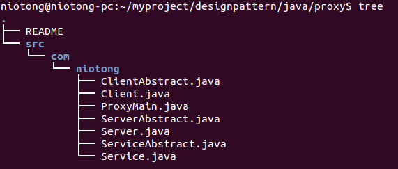
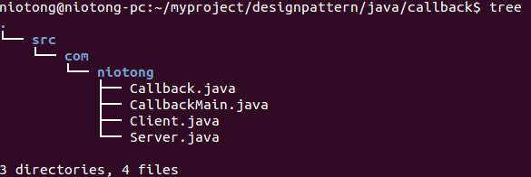

用java实现来代理模式和callback，两者之间的相似之处和不同之处自己揣摩。代理模式的代理内容接口函数分别用抽象类和接口类实现本质一样。
**代理模式**

com.niotong.Service.java代码如下

```
package com.niotong;
//代理的内容，代理需要服务端做的事
public interface  Service {
	public abstract void eat();
	public abstract void shit();
	public abstract void sleep();
}
```

com.niotong.Client.java代码如下

```
package com.niotong;
//实现需要代理的内容
public class Client implements Service{

	@Override
	public void eat() {
		// TODO Auto-generated method stub
		System.out.print("client eat \n");
	}

	@Override
	public void shit() {
		// TODO Auto-generated method stub
		System.out.print("client shit \n");
	}

	@Override
	public void sleep() {
		// TODO Auto-generated method stub
		System.out.print("client sleep \n");
	}

}
```

com.niotong.Server.java代码如下

```
package com.niotong;

public class Server implements Service{
	private Client cli;
	Server(Client cli){
		this.cli = cli;
	}
	@Override
	public void eat() {
		// TODO Auto-generated method stub
		//回调客户端
		cli.eat();
	}

	@Override
	public void shit() {
		// TODO Auto-generated method stub
		cli.shit();
	}

	@Override
	public void sleep() {
		// TODO Auto-generated method stub
		cli.sleep();
	}

}
```

以上基本实现来代理模式，就差main函数了。下面是用抽象类来实现上面的代码。

com.niotong.ServiceAbstract.java代码如下

```
package com.niotong;

public abstract class ServiceAbstract {
	public abstract void eat();
	public abstract void shit();
	public abstract void sleep();
}
```

com.niotong.ClientAbstract.java代码如下

```
package com.niotong;
//继承需要代理内容的抽象类，实现需要代理的内容
public class ClientAbstract extends ServiceAbstract{

	@Override
	public void eat() {
		// TODO Auto-generated method stub
		System.out.print("client eat \n");
	}

	@Override
	public void shit() {
		// TODO Auto-generated method stub
		System.out.print("client shit \n");
	}

	@Override
	public void sleep() {
		// TODO Auto-generated method stub
		System.out.print("client sleep \n");
	}

}
```

com.niotong.ServerAbstract.java代码如下

```
package com.niotong;
//继承代理内容的抽象类
public class ServerAbstract extends ServiceAbstract{
	private ClientAbstract cli;
	public ServerAbstract(ClientAbstract cli) {
		// TODO Auto-generated constructor stub
		this.cli = cli;
	}
	@Override
	public void eat() {
		// TODO Auto-generated method stub
		cli.eat();
	}

	@Override
	public void shit() {
		// TODO Auto-generated method stub
		cli.shit();
	}

	@Override
	public void sleep() {
		// TODO Auto-generated method stub
		cli.sleep();
	}

}
```

这是抽象类实现的，基本和接口实现的没差

以下是主函数com.niotong.ProxyMain.java代码如下

```
package com.niotong;

public class ProxyMain {

	public static void main(String[] args) {
		// TODO Auto-generated method stub
		Client cli = new Client();
		Server ser = new Server(cli);		//让服务端代理
		ser.eat();
		ser.shit();
		ser.sleep();
		ClientAbstract cliabs = new ClientAbstract();
		ServiceAbstract serabs = new ServerAbstract(cliabs);
		serabs.eat();
		serabs.shit();
		serabs.sleep();
		return;
	}

}
```

至此代理模式就简单的实现了

**callback**

com.niotong.Callback.java代码如下

```
package com.niotong;

public interface Callback {
	public abstract void callback(String mesg);
}
```

com.niotong.Client.java代码如下

```
package com.niotong;

public class Client implements Callback{

	//持有快递公司的引用
	public Server ser = new Server(Client.this);
	//我寄件
	public void send(){
		System.out.print("wo shi ke hu ,wo yao ji jian!\n");
		ser.recive(); //将会回调
	}
	//回调函数
	@Override
	public void callback(String mesg) {
		// TODO Auto-generated method stub
		System.out.print("jie dao kuai di lai de dian hua "+ mesg+"\n");
	}

}
```

com.niotong.Server.java代码如下

```
package com.niotong;

public class Server  {
	private Callback cal;
	Server(Callback cal){
		this.cal = cal;
	}
	public void recive(){
		callback("wo yao lai shou jian lliao\n");
	}
	public void callback(String a){
		cal.callback(a);
	}
}
```

主函数com.niotong.CallbackMain.java代码如下

```
package com.niotong;


public class CallbackMain {

	public static void main(String[] args) {
		// TODO Auto-generated method stub
		Client cli = new Client();
		cli.send();
	}

}
```

至此回调也实现了。回调和代理模式的代码稍微对比下应该能够看出区别

