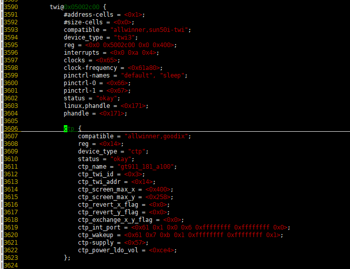
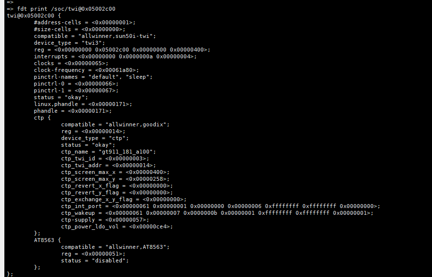
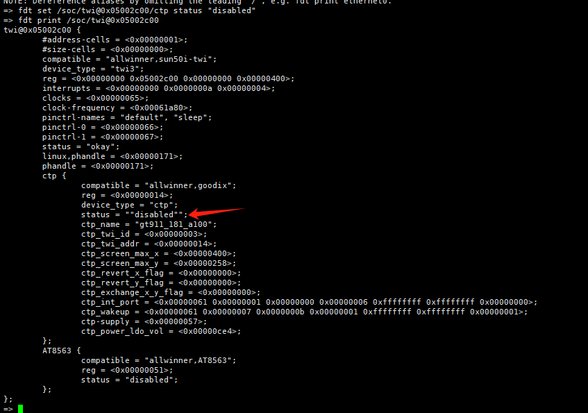

# 使用fdt修改dts配置

比如修改ctp的某一个配置
1.先去全志编译目录下下找到.sunxi.dts文件，然后找到你想修改的配置

vim  tina/out/a133-aw/image/.sunxi.dts

2.启动机器在调试串口终端界面长按s，让机器停在boot阶段，然后执行 fdt print /soc/twi@0x05002c00

3.然后执行命令fdt set /soc/twi@0x05002c00/ctp status "disabled"

从上可以看出已经修改到位，然后执行boot命令就能启动内核了
注意机器重启之后dts的修改会还原

