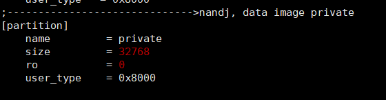
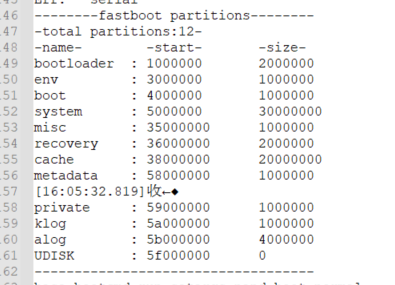
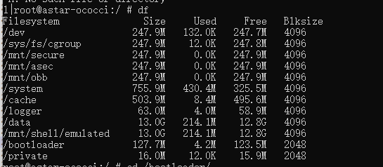

# 全志分区大小
以private分区为例，该分区可以存储snum和mac地址等，在sys_partition.fex中

在内核打印信息中会有相关分区的一些信息如下

通过mount -o remount,rw /   （重新挂载根目录，使其可写）  mkdir /private          mount -t vfat /dev/block/by-name/private /private  （挂载private分区），然后执行df命令

可以看出private分区大小为16M.
如此我们可以算算他们之间的关系了
16M=16384KB==16777216 bit=0x1000000 bit,
所以串口中打印大小单位为bit，sys_partition.fex中size的单位为扇区（每一个扇区大小为512KB）

现在以system分区来看下是否正确
sys_partition.fex分配给system分区大小为1572864 x 512kb =805306368 bit =  0x30000000 bit = 768 M
可以看出来除了df中看到的大小不怎么一致外其他都能对应上，df看到的之所以是755.9M，应该是某些东西（类似于文件头信息）占了些空间。注意像system分区，在android系统中会有个BOARD_SYSTEMIMAGE_PARTITION_SIZE := 805306368
如果该值和分区大小不一致的话，可能会导致系统无法正常启动。