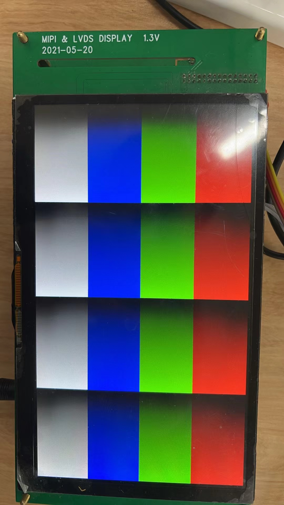
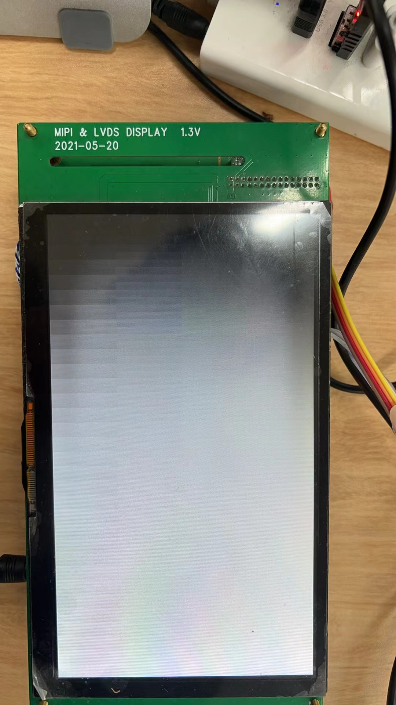
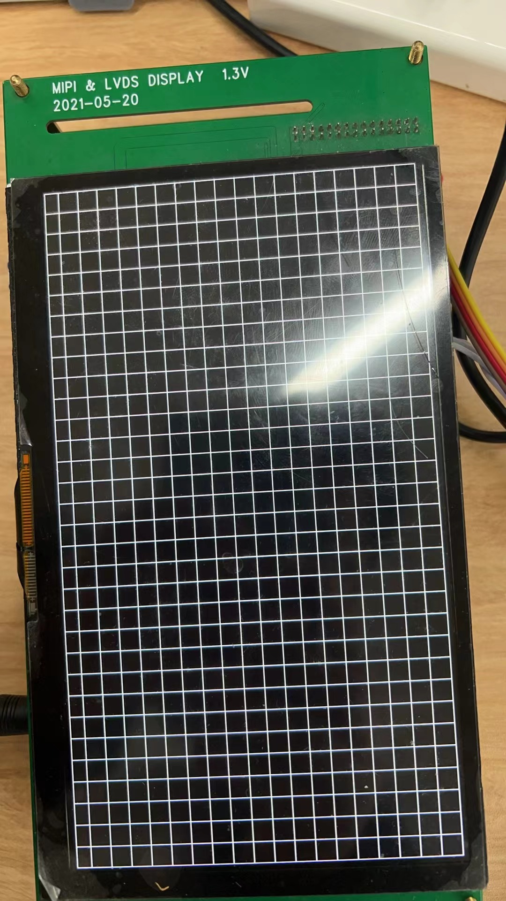
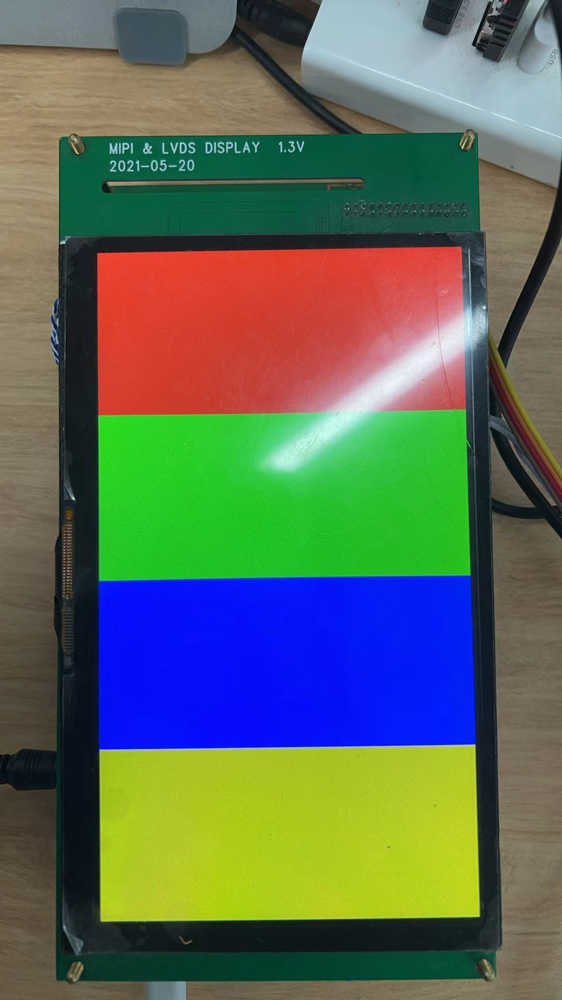

# 全志显示屏调试

有一次调试客户的EDP屏的时候，uboot阶段有显示，但是开机动画没有显示，这是由于客户机器开机之后很多服务被kill掉了造成的

调试的时候显示colorbar或者棋盘图
切换到棋盘图：

```
cd /sys/class/sunxi\_dump;echo 0x06540020 0x00000006 > write
```

切换到colorbar图：

```
cd /sys/class/sunxi\_dump;echo 0x06540020 0x00000005 > write
```
如果是linux-4.9内核，操作如下

主显：

```
echo 0 > /sys/class/disp/disp/attr/disp          // 0 表示主显示   1表示副显
echo 1 > /sys/class/disp/disp/attr/colorbar    //1切换到colorbar  2灰阶图 7切换到棋盘图  8红绿蓝黄
```






