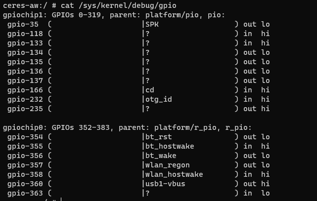
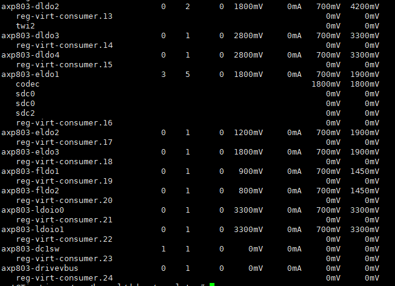
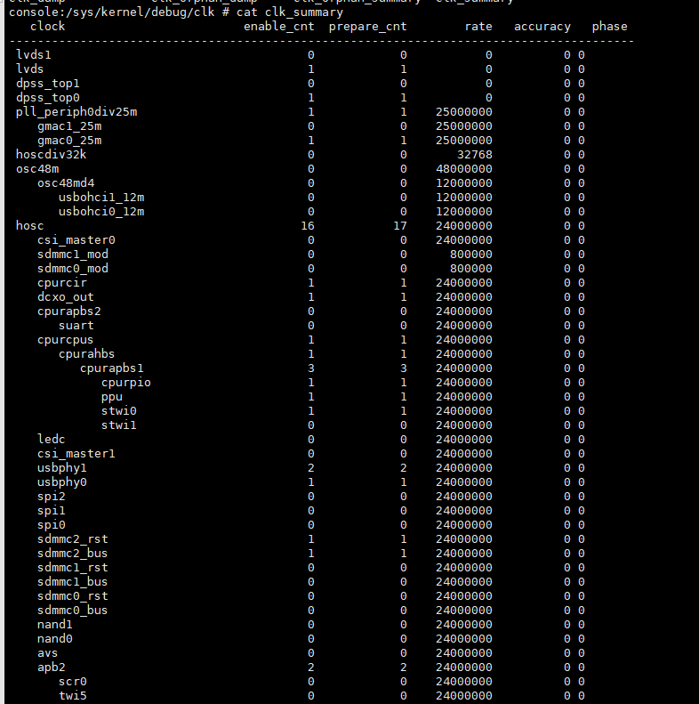
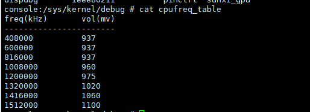

# 全志调试知识点

可以执行mount -t debugfs debug /proc/sys/debug命令，将调试信息挂载在/proc/sys/debug/目录下，由于A133开机就挂载了所以不用执行这个命令，对应的挂载的目录也不同，请自行注意

## 1.GPIO

以A133为例，可以cat  /sys/kernel/debug/gpio来稍微看下相关gpio的使用情况。如下图

其中编号可以看下linux-4.9/include/linux/sunxi-gpio.h
对于a40i系统，可以看linux-3.10/include/linux/sys_config.h

## 2.供电

可以cat /sys/kernel/debug/regulator/regulator_summary查看供电相关的信息

## 3.时钟

可以cat  /sys/kernel/debug/clk/clk_summary  查看各分频情况

## 4.cpu频率和电压对应表

cat   /sys/kernel/debug/cpufreq_table

## 5.读取全志寄存器

> cd /sys/class/dump_reg

打印单个寄存器

> echo 0x01c20000 > dump
> 
> cat dump

打印一段连续寄存器

> echo 0x01c20004,0x01c20058 > dump
> 
> cat dump

写单个寄存器的值（往0x01c20800寄存器写0x00000031)

> echo  0x01c20800 0x00000031 > write

还有其他的一些寄存器调试方法，请看《Sunxi_dump_reg模块使用文档.pdf》

