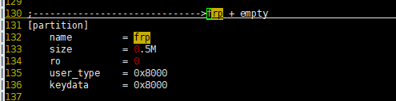
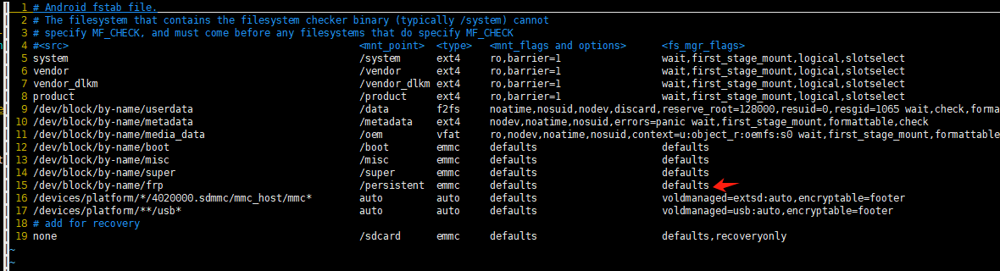

# 如何使用android的frp分区

在Android系统中，FRP（Factory Reset Protection，工厂重置保护）是一种安全机制，旨在防止设备被盗后通过恢复出厂设置绕过原用户账号验证。
从deepseek查找到的知识总结一下：1.frp分区存储一些重要信息其实它的功能有些和private分区类似。2.烧录frp分区的img 可以从线刷包提取 或者 从同型号设备备份 或者其他第三方工具或者社区资源 3.以为全官方没有frp相关的太多资料，且frp分区是android原生就有的，所以我需要自己去制作一个frp的固件。

以下是我那拿B810 android12来测试的。

分区问价sys\_partition.fex中frp分区分配空间为0.5M
然后fstab.sun50iw10p1中

实际上设备的根目录下是没有/persistent 这个目录的，且不太清楚fstab的具体工作原理的。

现在开始着手制作frp用的img包

> dd if=/dev/zero of=persist.img bs=512k count=1

这样就生成了大小为512k的persist.img文件，然后

> mkfs.ext4 persist.img

这样就能将persist.img格式化成ext4格式的文件系统

然后将persist.img文件push进设备中，然后在设备中执行dd命令烧录，然后执行mount命令挂载

> dd if=/data/persist.img of=/dev/block/by-name/frp
> mkdir /mnt/frp
> mount -t ext4 /dev/block/by-name/frp /mnt/frp

这样就可以将frp分区挂载到系统中，但是这应该不算是非常标准的frp分区的使用，建议研究一下fstab 看看frp分区应该烧录什么样格式的分区，然后创建/persistent这样的根目录，争取让机器启动之后就能通过fstab挂载分区 不需要手动执行命令去挂载。

