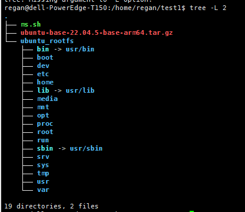
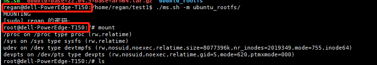
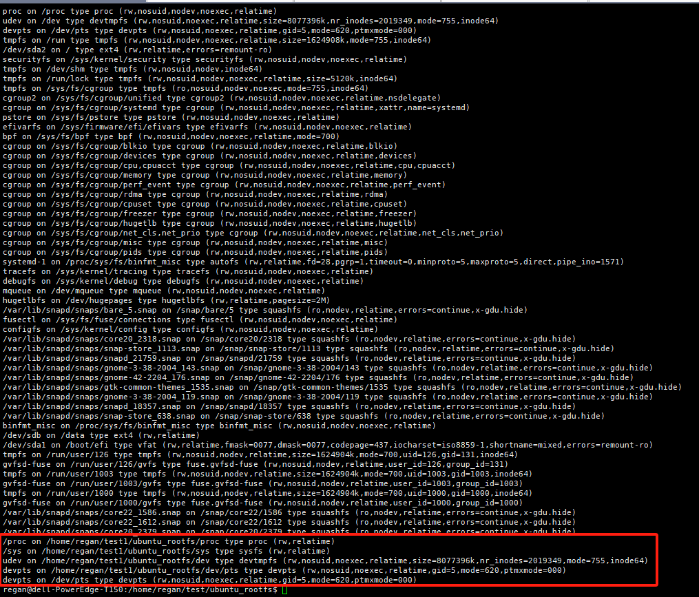
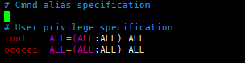
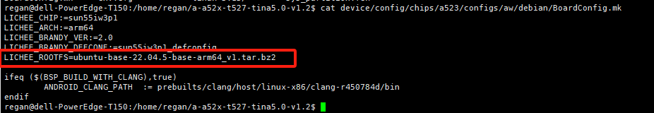
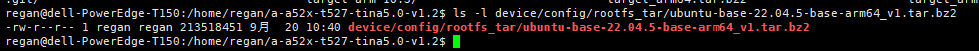
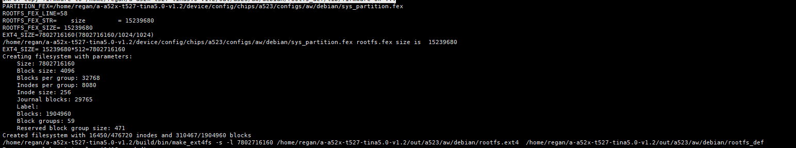

# 如何制作ubuntu文件系统(以全志A523作为示例)

## 下载ubuntu原生文件系统

[https://cdimage.ubuntu.com/ubuntu-base/releases/22.04.3/release/](https://cdimage.ubuntu.com/ubuntu-base/releases/22.04.3/release/) 找一个你需要的cpu架构的文件系统下载下来，我下载的是ubuntu-base-22.04.5-base-arm64.tar.gz 。

## 解压根文件系统

```
mkdir ubuntu_rootfs
tar -xvf ubuntu-base-22.04.5-base-arm64.tar.gz -C ubuntu_rootfs/
```

解压完目录结构大概就是如下这样

解压完成之后这个ubuntu_rootfs文件夹大小为76M

## 配置网络和主机名

```
cp /etc/resolv.conf ubuntu_rootfs/etc/resolv.conf
echo "nameserver 8.8.8.8" >> ubuntu_rootfs/etc/resolv.conf
echo "nameserver 114.114.114.114" >> ubuntu_rootfs/etc/resolv.conf
echo "ALLWINNER" > ubuntu_rootfs/etc/hostname
echo "127.0.0.1 localhost" >> ubuntu_rootfs/etc/hosts
echo "127.0.0.1 ALLWINNER" >> ubuntu_rootfs/etc/hosts
echo "127.0.0.1 localhost ALLWINNER" >> ubuntu_rootfs/etc/hosts
```

这项操作不做的话，会导致后续挂载文件系统之后无法联网

## 更换软件源

> vim ubuntu_rootfs/etc/apt/sources.list

内容修改成如下

```
# See http://help.ubuntu.com/community/UpgradeNotes for how to upgrade to
# newer versions of the distribution.
deb http://mirrors.aliyun.com/ubuntu-ports/ focal main restricted
# deb-src http://mirrors.aliyun.com/ubuntu-ports/ focal main restricted


## Major bug fix updates produced after the final release of the
## distribution.
deb http://mirrors.aliyun.com/ubuntu-ports/ focal-updates main restricted
# deb-src http://mirrors.aliyun.com/ubuntu-ports/ focal-updates main restricted


## N.B. software from this repository is ENTIRELY UNSUPPORTED by the Ubuntu
## team. Also, please note that software in universe WILL NOT receive any
## review or updates from the Ubuntu security team.
deb http://mirrors.aliyun.com/ubuntu-ports/ focal universe
# deb-src http://mirrors.aliyun.com/ubuntu-ports/ focal universe
deb http://mirrors.aliyun.com/ubuntu-ports/ focal-updates universe
# deb-src http://mirrors.aliyun.com/ubuntu-ports/ focal-updates universe


## N.B. software from this repository is ENTIRELY UNSUPPORTED by the Ubuntu
## team, and may not be under a free licence. Please satisfy yourself as to
## your rights to use the software. Also, please note that software in
## multiverse WILL NOT receive any review or updates from the Ubuntu
## security team.
deb http://mirrors.aliyun.com/ubuntu-ports/ focal multiverse
# deb-src http://mirrors.aliyun.com/ubuntu-ports/ focal multiverse
deb http://mirrors.aliyun.com/ubuntu-ports/ focal-updates multiverse
# deb-src http://mirrors.aliyun.com/ubuntu-ports/ focal-updates multiverse


## N.B. software from this repository may not have been tested as
## extensively as that contained in the main release, although it includes
## newer versions of some applications which may provide useful features.
## Also, please note that software in backports WILL NOT receive any review
## or updates from the Ubuntu security team.
deb http://mirrors.aliyun.com/ubuntu-ports/ focal-backports main restricted universe multiverse
# deb-src http://mirrors.aliyun.com/ubuntu-ports/ focal-backports main restricted universe multiverse


## Uncomment the following two lines to add software from Canonical's
## 'partner' repository.
## This software is not part of Ubuntu, but is offered by Canonical and the
## respective vendors as a service to Ubuntu users.
# deb http://archive.canonical.com/ubuntu focal partner
# deb-src http://archive.canonical.com/ubuntu focal partner


deb http://mirrors.aliyun.com/ubuntu-ports/ focal-security main restricted
# deb-src http://mirrors.aliyun.com/ubuntu-ports/ focal-security main restricted
deb http://mirrors.aliyun.com/ubuntu-ports/ focal-security universe
# deb-src http://mirrors.aliyun.com/ubuntu-ports/ focal-security universe
deb http://mirrors.aliyun.com/ubuntu-ports/ focal-security multiverse
# deb-src http://mirrors.aliyun.com/ubuntu-ports/ focal-security multiverse
# 默认注释了源码镜像以提高 apt update 速度，如有需要可自行取消注释
deb http://mirrors.bfsu.edu.cn/ubuntu-ports/ jammy main restricted universe multiverse
# deb-src http://mirrors.bfsu.edu.cn/ubuntu-ports/ jammy main restricted universe multiverse
deb http://mirrors.bfsu.edu.cn/ubuntu-ports/ jammy-updates main restricted universe multiverse
# deb-src http://mirrors.bfsu.edu.cn/ubuntu-ports/ jammy-updates main restricted universe multiverse
deb http://mirrors.bfsu.edu.cn/ubuntu-ports/ jammy-backports main restricted universe multiverse
# deb-src http://mirrors.bfsu.edu.cn/ubuntu-ports/ jammy-backports main restricted universe multiverse


# deb http://mirrors.bfsu.edu.cn/ubuntu-ports/ jammy-security main restricted universe multiverse
# # deb-src http://mirrors.bfsu.edu.cn/ubuntu-ports/ jammy-security main restricted universe multiverse


deb http://ports.ubuntu.com/ubuntu-ports/ jammy-security main restricted universe multiverse
# deb-src http://ports.ubuntu.com/ubuntu-ports/ jammy-security main restricted universe multiverse


# 预发布软件源，不建议启用
# deb http://mirrors.bfsu.edu.cn/ubuntu-ports/ jammy-proposed main restricted universe multiverse
# # deb-src http://mirrors.bfsu.edu.cn/ubuntu-ports/ jammy-proposed main restricted universe multiverse
```

上面的修改是综合[https://blog.csdn.net/qq_34117760/article/details/130909986?ops_request_misc=&request_id=&biz_id=102&utm_term=Ubuntu%E6%96%87%E4%BB%B6%E7%B3%BB%E7%BB%9F%E6%9E%84%E5%BB%BA&utm_medium=distribute.pc_search_result.none-task-blog-2~blog~sobaiduweb~default-6-130909986.nonecase&spm=1018.2226.3001.4450](https://blog.csdn.net/qq_34117760/article/details/130909986?ops_request_misc=&request_id=&biz_id=102&utm_term=Ubuntu%E6%96%87%E4%BB%B6%E7%B3%BB%E7%BB%9F%E6%9E%84%E5%BB%BA&utm_medium=distribute.pc_search_result.none-task-blog-2~blog~sobaiduweb~default-6-130909986.nonecase&spm=1018.2226.3001.4450)  和[https://blog.csdn.net/weixin_46025014/article/details/131682463?ops_request_misc=&request_id=&biz_id=102&utm_term=Ubuntu%E6%96%87%E4%BB%B6%E7%B3%BB%E7%BB%9F%E6%9E%84%E5%BB%BA&utm_medium=distribute.pc_search_result.none-task-blog-2~blog~sobaiduweb~default-2-131682463.nonecase&spm=1018.2226.3001.4450](https://blog.csdn.net/weixin_46025014/article/details/131682463?ops_request_misc=&request_id=&biz_id=102&utm_term=Ubuntu%E6%96%87%E4%BB%B6%E7%B3%BB%E7%BB%9F%E6%9E%84%E5%BB%BA&utm_medium=distribute.pc_search_result.none-task-blog-2~blog~sobaiduweb~default-2-131682463.nonecase&spm=1018.2226.3001.4450)做的修改，这有利于ubuntu软件的下载

## 配置仿真开发环境

```
sudo apt install qemu-user-static
cp /usr/bin/qemu-aarch64-static ubuntu_rootfs/usr/bin/
```

## 挂载根文件系统

挂载文件系统用的ms.sh脚本内容如下

```
#!/bin/bash                                                                                                                                                                                                                                                               
mnt ()
{
echo "MOUNTING"
sudo mount -t proc /proc ${2}proc
sudo mount -t sysfs /sys ${2}sys
sudo mount -o bind /dev ${2}dev
sudo mount -o bind /dev/pts ${2}dev/pts
sudo chroot ${2}
}
umnt ()
{
echo "UNMOUNTING"
sudo umount ${2}proc
sudo umount ${2}sys
sudo umount ${2}dev/pts
sudo umount ${2}dev
}
if [ "$1" = "-m" ] && [ -n "$2" ];
then
mnt $1 $2
echo "mnt -m pwd"
elif [ "$1" = "-u" ] && [ -n "$2" ];
then
umnt $1 $2
echo "mnt -u pwd"
else
echo ""
echo "Either 1'st, 2'nd or bothparameters were missing"
echo ""
echo "1'st parameter can be one ofthese: -m(mount) OR -u(umount)"
echo "2'nd parameter is the full pathof rootfs directory(with trailing '/')"
echo ""
echo "For example: ch-mount -m/media/sdcard/"
echo ""
echo 1st parameter : ${1}
echo 2nd parameter : ${2}
fi
```

执行脚本之前，主机的mount信息如下


执行下面命令可以将ubuntu根文件系统挂载到主机上（需要sudo权限）

> ./ms.sh -m ubuntu_rootfs/

执行完之后，如果需要退出挂载的话，执行exit  然后执行./ms.sh -u  ubuntu_rootfs/命令就行

在另外一个终端上执行mount命令看到如下信息

红框处就表示根文件系统已经挂载到本地了

## 安装软件

```
#更新软件
apt update
apt upgrade
#安装必要工具
apt install vim bash-completion net-tools iputils-ping ifupdown ethtool ssh rsync udev htop rsyslog curl openssh-server apt-utils dialog nfs-common language-pack-en-base sudo kmod apt-transport-https psmisc systemd -y
```

执行上面命令的时候可能会碰到apt update报 InRelease: Couldn't create temporary file /tmp/apt.conf.AIB6DE for passing config to apt-key 这种错误的情况chmod  1777 /tmp 就可以解决了。systemd这个安装之后可以作为文件系统的启动入口（lib/systemd/systemd)

## 修改root用户密码，添加新用户和给新用户赋予sudo权限

```
#修改root用户的权限
passwd root
#添加ococci新用户
adduser ococci
#给ococci添加sudo权限
usermod -aG sudo ococci
```

给其他用户添加root权限也有其他方法，比如vim /etc/sudoers



## 重新打包压缩根文件系统

> sudo tar -cjvf ubuntu-base-22.04.5-base-arm64_v1.tar.bz2 --directory=ubuntu_rootfs --strip-components=1 .

这样就能将ubuntu_rootfs/目录按照原本的结构制作成ubuntu-base-22.04.5-base-arm64_v1.tar.bz2

## A523的ubuntu根文件系统的使用

全志的制作文件系统的主要命令在build/mkcmd.sh中，大概内容如下

```
function build_debian_rootfs()
{
    local ROOTFS=${LICHEE_PLAT_OUT}/rootfs_def
    local ROOTFS_FIRWMARE_PATH=${ROOTFS}/lib/firmware
    local INODES=""
    local BLOCKS=""
    local rootfs_archive=""
    local rootfs_archivedir=""
    local install_libs=""
    local install_libs_common=""
    local boardconfig="${LICHEE_BOARDCONFIG_PATH}"
    local main_version=${LICHEE_KERN_VER/.*/}
    local sub_version=${LICHEE_KERN_VER/*./}


    main_version=${main_version/linux-}


    #rootfs_archive=`cat ${boardconfig} | grep -w "LICHEE_ROOTFS" | awk -F= '{printf $2}'`
    rootfs_archive=${LICHEE_ROOTFS}
    rootfs_archivedir=${LICHEE_DEVICE_DIR}/config/rootfs_tar/${rootfs_archive}
    install_libs=${LICHEE_DEVICE_DIR}/config/rootfs_tar/install_libs/${LICHEE_BOARD}
    install_libs_common=${LICHEE_DEVICE_DIR}/config/rootfs_tar/install_libs/common


    mk_info "Build debian rootfs ..."


    if [ "$1" = "f" ]; then
        rm -fr ${ROOTFS}
    fi


    # bsp uses the compressed file system, just decompress them here,
    # but starting from gcc-10.3, use the extracted folder to directly copy
    if [ ! -d ${ROOTFS} ]; then
        if [ -d ${rootfs_archivedir} ]; then
            mkdir -p ${ROOTFS}
            cp -r ${rootfs_archivedir}/* ${ROOTFS}
        elif [ -f ${rootfs_archivedir} ]; then
            mkdir -p ${ROOTFS}
            fakeroot tar -jxf ${rootfs_archivedir} -C ${ROOTFS}
        else
            mk_error "cann't find ${rootfs_archive}"
            exit 1
        fi
    fi


    if [ -d ${install_libs_common} ];then
        cp -rf ${install_libs_common}/* ${ROOTFS}/
    fi


    if [ -d ${install_libs} ];then
        cp -rf ${install_libs}/* ${ROOTFS}/
    fi


    # the following operation is similar to the pack_buildroot_rootfs() -> copy the ko and others that systenm need
    rm -rf ${ROOTFS}/lib/modules
    mkdir -p ${ROOTFS}/lib/modules
    cp -rf ${KERNEL_STAGING_DIR}/lib/modules/* \
        ${ROOTFS}/lib/modules/
    if [[ "$main_version" > "5" ]] || [[ "$main_version" == "5" ]] && [[ "$sub_version" -ge "10" ]]; then
        cp ${LICHEE_CHIP_CONFIG_DIR}/configs/default/${LICHEE_KERN_VER}/S50module ${ROOTFS}/etc/init.d/
    else
        cp ${LICHEE_CHIP_CONFIG_DIR}/configs/default/S50module ${ROOTFS}/etc/init.d/
    fi


    if [ "x$PACK_STABILITY" = "xtrue" -a -d ${LICHEE_KERN_DIR}/tools/sunxi ];then
        cp -v ${LICHEE_KERN_DIR}/tools/sunxi/* ${ROOTFS}/bin
    fi


    copy_bin_firmware ${ROOTFS_FIRWMARE_PATH}


    if [ "x$LICHEE_LINUX_DEV" = "xsata" ];then
        if [ -d ${ROOTFS}/target ];then
            rm -rf ${ROOTFS}/target
        fi
        if [ -d ${LICHEE_SATA_DIR}/linux/target ];then
            mk_info "copy SATA rootfs"
            mkdir -p ${ROOTFS}/target
            cp -a ${LICHEE_SATA_DIR}/linux/target/* ${ROOTFS}/target
        fi
    fi


    (cd ${ROOTFS}; ln -fs bin/busybox init)
    #substitute_inittab ${ROOTFS}/etc/inittab


    export PATH=$PATH:${LICHEE_BUILD_DIR}/bin
    fakeroot chown     -h -R 0:0    ${ROOTFS}
    #fakeroot mke2img -d ${ROOTFS} -G 4 -R 1 -B 0 -I 0 -o ${LICHEE_PLAT_OUT}/rootfs.ext4
    make_ext4 ${ROOTFS}
    # 321 * 258048, about 79M, it should be enough for small capacity spinand


    if [ -n "`echo $LICHEE_KERN_VER | grep "linux-[34].[149]"`" ] || [ "x${LICHEE_KERN_VER}" = "xlinux-5.4" ]; then
        fakeroot mkfs.ubifs -m 4096 -e 258048 -c 375 -F -x zlib -r ${ROOTFS} -o ${LICHEE_PLAT_OUT}/rootfs.ubifs
    else
        fakeroot mkfs.ubifs -m 2048 -e 126976 -c 375 -F -x zlib -r ${ROOTFS} -o ${LICHEE_PLAT_OUT}/rootfs.ubifs
    fi


cat  > ${LICHEE_PLAT_OUT}/.rootfs << EOF
chown -h -R 0:0 ${ROOTFS}
${LICHEE_BUILD_DIR}/bin/makedevs -d \
${LICHEE_DEVICE_DIR}/config/rootfs_tar/_device_table.txt ${ROOTFS}
${LICHEE_BUILD_DIR}/bin/mksquashfs \
${ROOTFS} ${LICHEE_PLAT_OUT}/rootfs.squashfs -root-owned -no-progress -comp xz -noappend
EOF


    chmod a+x ${LICHEE_PLAT_OUT}/.rootfs
    fakeroot -- ${LICHEE_PLAT_OUT}/.rootfs
}
```

其中需要特别注意的地方有：使用的是rootfs_archivedir 这个文件系统，这个在如下地方配置的

文件系统的压缩包放置在

编译的时候会解压到out/a523/aw/debian/rootfs_def/
device/config/rootfs_tar/install_libs/目录下的内容会最终覆盖到out/a523/aw/debian/rootfs_def/
下面是A523编译时候对out/a523/aw/debian/rootfs_def/的一些处理


