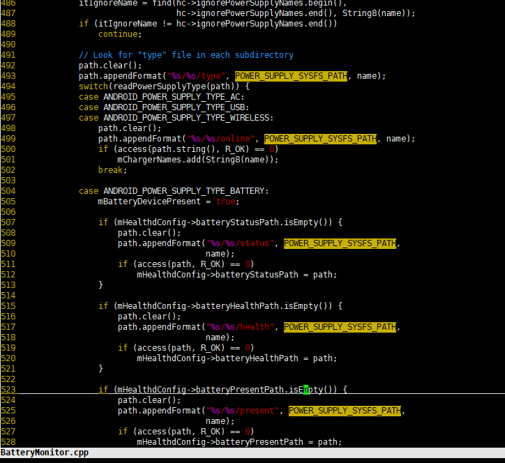
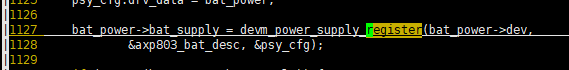
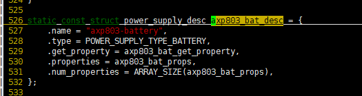
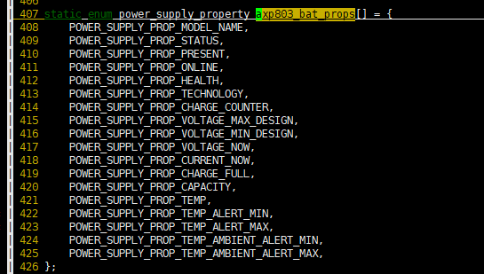
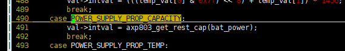
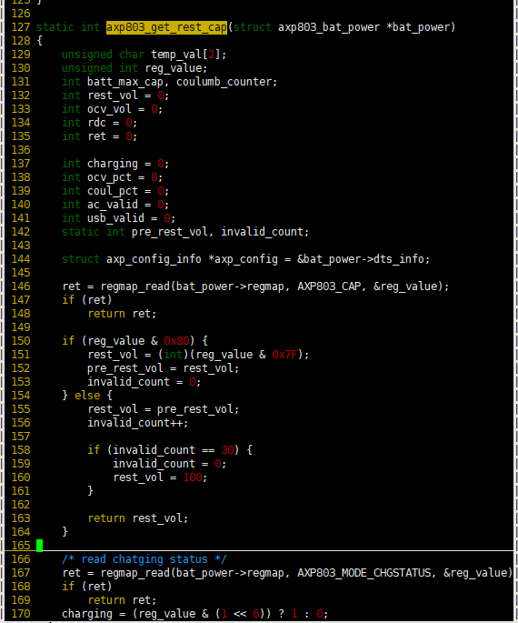
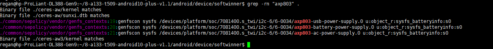

# 如何添加外挂电量计

客户因为功放从电池直接取电，导致axp707无法使用内部电量计统计电量的充放，所以导致电池曲线不准，且客户关闭电量计采用电压计来表示电池的电量，因为功放的关系，当机器发出声音的时候，ocv计算到的电压（来源于AXP803_OCVBATH_RES 0xBC寄存器）波动大概50mV,所以只采用电压计测出来的电池曲线也不线性。

客户准备在电池端加一个I2C接口的外挂电量计专门用来显示电池的电量。

先分析AXP707如何上报的电池电池电量。从系统层开始，主要的代码在`android/system/core/healthd/BatteryMonitor.cpp`

> #define POWER_SUPPLY_SUBSYSTEM "power_supply"
> #define POWER_SUPPLY_SYSFS_PATH "/sys/class/" POWER_SUPPLY_SUBSYSTEM

然后

这个地方会读取/sys/class/power_supply/下的所有文件夹下对应的type, online等节点，系统获取的电池电量就是capacity节点。对应BatteryMonitor::update应该就是隔段时间读取一下这些节点的值，然后同步到系统中。（这些东西应该是标准的，相对应的驱动这块应该也是标准的）
现在再看下驱动，驱动在longan/kernel/linux-4.9/drivers/power/supply/目录下的axp803_ac_power.c  axp803_battery.c  axp803_usb_power.c 这些对应到/sys/class/power_supply/下的axp803-ac axp803-battery axp803-usb
然后我们只看axp803_battery.c
注册如下：

然后axp803_get_rest_cap（）就是去读去axp707的寄存器 上报电量值。、

以上基本就是整个流程。
然后电池电量要使用外挂电量计，所以可以参考axp803_battery.c写一个驱动，然后把axp803_battery.c中POWER_SUPPLY_PROP_CAPACITY相关的节点取消注册，然后在外挂电量计的驱动去注册对应的supply设备，并且生成capacity节点（还要关注一下系统层那边healthd是否能够正确读取到电池电量 对应的应该会涉及到healthd读取/sys/class/power_supply/下节点的策略和权限问题）。

这部分完成之后，还有要协调外挂电量计和axp707的充电功能，因为存在外挂电量计检测到电池电量还没有到100%，但是axp707这边却认为电池电量到达了100%然后它停止充电的情况。也可能存在外挂电量计检测到电池电量到达100%，但是axp707却认为电池电量还没有达到100%然后继续充电。综上所述存在电池过充或者电池充不满的情况，当然可以让axp707的充电功能始终开启，然后电池本身有保护板防止过充。想要弄得完美得话，就有很多细节的东西需要去调试。

另外一个问题就是uboot中pmu_safe_vol的问题，因为这个配置决定了电池电压不能低于这个值开机，因为如果电池电压太低的话，可能在开机阶段因为功率不够无法成功开机。我不知道加了外挂电量计之后，axp707是否还能检测这个值，如果能检测到，那么这就不是个问题了。如果这块有问题的话，搞不好要在uboot中添加外挂电量计相关的驱动，麻烦的点还在于i2c驱动 貌似同一个时刻只能使用一组i2c总线（根据之前it6151的经验存在这种可能性）。以及longan/brandy/brandy-2.0/u-boot-2018/board/sunxi/power_manage.c中逻辑的微调。

