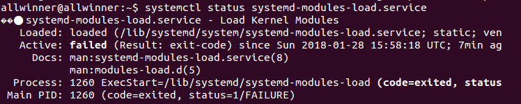
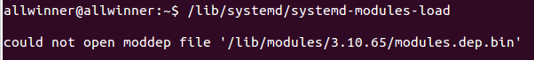

- **问题描述和分析解决**
  在制作ubuntu使用的文件系统的时候，开机之后发现自己制作的固件无法加载驱动，看串口打印的logcat，有

> [FAILED] Failed to start Load Kernel Modules.
> See 'systemctl status systemd-modules-load.service' for details.

这样的错误。执行“systemctl status systemd-modules-load.service”，看到如下信息


可以看出是执行/lib/systemd/systemd-modules-load命令出了错误，然后我执行了“/lib/systemd/systemd-modules-load”
命令，结果如下图


可以看出是因为没有找到modules.dep.bin这个文件，而/lib/modules/3.10.65/这个目录就是编译内核生成的。然后百度了一下modules.dep.bin是什么东西。
最终解决办法是在控制内核的编译脚本那里添加了如下命令就解决了modules无法加载的情况

```
make modules_install INSTALL_MOD_PATH=./output/ ARCH=$ARCH CROSS_COMPILE=$CROSS_COMPILE
```

