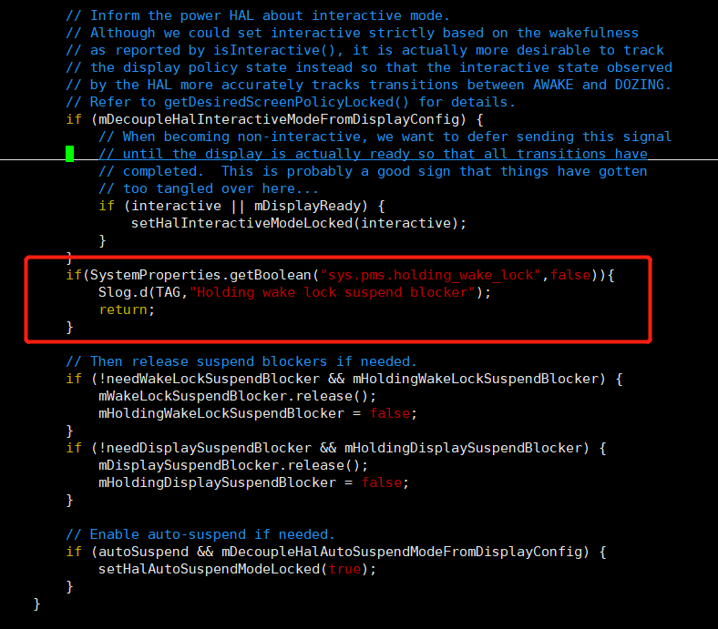

# 如何让系统不进去深度休眠
之前弄A63（android 7.1）的时候，替客户解决过使系统不进入深度休眠。
1.先弄清楚知识点，参考https://blog.csdn.net/xzx208/article/details/88078621
2.我采用的方法是修改rc文件
```
on fs
    wirte /sys/power/wake_lock ococci
```
之后在A133(android 10)同样实现这样一个功能的时候，是如下实现的，
在`frameworks/base/services/core/java/com/android/server/power/PowerManagerService.java`中函数updateSuspendBlockerLocked()中做如下修改


然后在ceres-aw.mk中加入
```
PRODUCT_SYSTEM_DEFAULT_PROPERTIES += sys.pms.holding_wake_lock=true
```