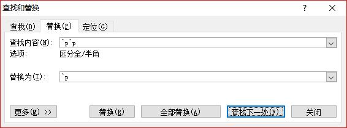
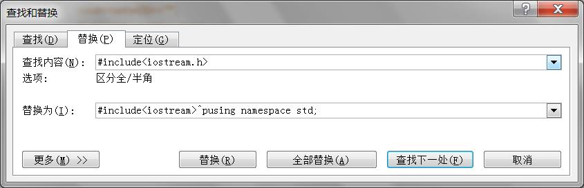
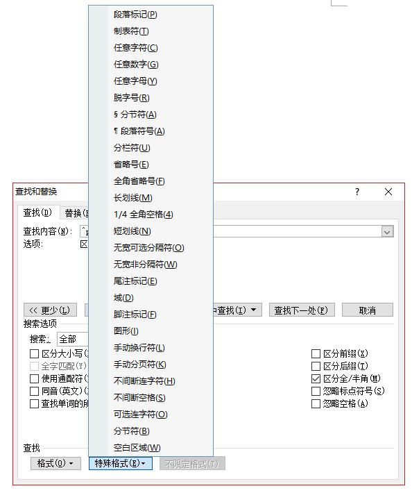
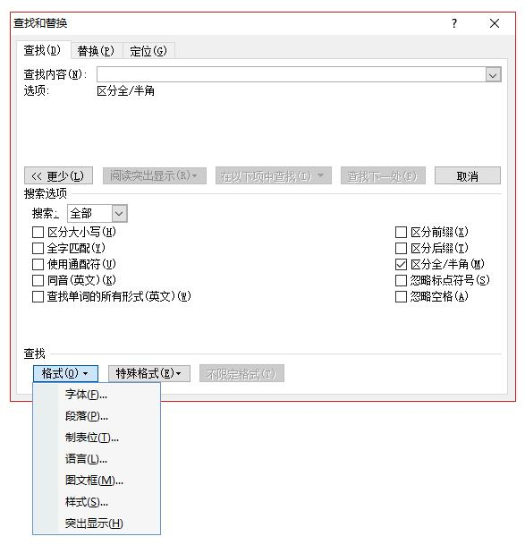
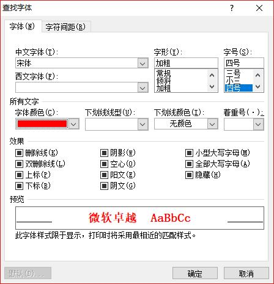
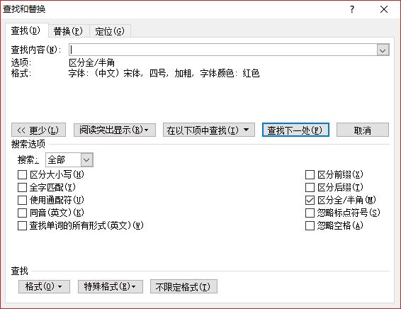

# 通配符
查找和替换是所有提供文本编辑的软件所具有的最基本的功能，但在功能和使用上仍然有细微的区别。

如notepad提供对所有打开的文档进行全部的查找替换的功能，dreamweaver可以复制包含有段落格式的文本进行查找和替换(在查找和替换对话框内，可以使用shift+enter来进行分段)。word不一样，不能复制包含有段落格式的文本，但可以使用特殊格式，用^p来表示段落。

1. 替换掉空段落


2. 查找或替换需要换行的文本

3. 可以使用的特殊格式

如果想替换掉全部图形，则只需在查找对话框内输入^g，全部替换掉即可。

4. 按字符、段落等格式进行查找

如要查找“红色、四号、加粗、宋体的文本：

可以看到查找对话框中的格式：

当进行常规查找(不考虑字符格式)时，需要单击”不限定格式“。

5. 使用通配符

```
使用通配符查找 在输入查找内容时，可以使用问号(？)和星号(*)作为通配符，只需在搜索选项中勾选”使用通配符“即可。

如果查找问号(？)和星号(*)则 在其字符前加上波浪号(～)。

* 表示零个到多个字符。例如，s*d 可查找―sad和―started。

? 表示任意单个字符，涵盖任意字母.。例如，s?t 可查找―sat和―set。

< 单词开头。例如，

> 单词结尾。例如，(in)> 查找―in和―within，但不查找―interesting。

[ ] 指定字符之一。例如，w[io]n 查找―win和―won。

[-] 指定范围内任意单个字符。例如，[r-t]ight 查找―right和―sight。必须用升序来表示该范围。再如[a-z]和[A-Z]表示所有英文字符，必须用升序来表示该范围。[0-9]表示所有数字字符。

[!x-z] 中括号内指定字符范围以外的任意单个字符。例如，t[!a-m]ck 查找―tock和―tuck，但不查找―tack和―tick。 {n} n 个重复的前一字符或表达式。例如，fe{2}d 查找―feed，但不查找―fed。

{n,} 至少 n 个前一字符或表达式。例如，fe{1,}d 查找―fed和―feed。

{n,m} n 到 m 个前一字符或表达式。例如，10{1,3} 查找―10、―100和―1000。

@ 一个以上的前一字符或表达式。例如，lo@t 查找―lot和―loot。

可使用括号对通配符和文字进行分组，以指明处理次序，例如，可以通过键入― 来查找―presorted 和―prevented 。 可使用  通配符搜索表达式(n为数字，代表分组的组号)，然后将其替换为经过重新排列的表达式，例如，在―查找内容 框键入―(Newton) (Christie) ，在―替换为 框键入―21 ，Word 将找到―Newton Christie 并将其替换为―Christie Newton 。

使用通配符时，搜索文字区分大小写。例如，搜索―s*t 将找到―sat 而不是―Sat 或―SAT 。如果要搜索大小写字母混合的单词，可使用方括号通配符。例如，键入―[Ss]*[Tt] 查找―sat 、―Sat 或―SAT 。
```

以下常用
```
^表示行首
$表示行尾
```